# Action Tracking in Action Tracker

The action tracking section allows you to track progress of implementation of the  actions and allows users to update the implementation status of the and review. It provides updates of the status of actions; whether they are not done, in progress, completed or cancelled. It allows for comments on selected status and selection of a period when the action will be next reviewed.

## Action Tracking

To access the action tracking options, click on the Action Tracking tab.

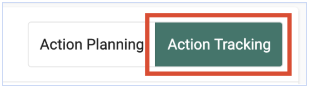{width=50%}

To update progress on implementation of an action, click on the add button in the reporting period

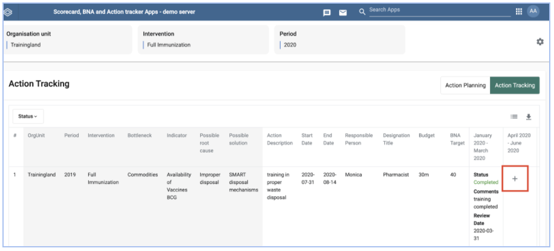{width=50%}

## Action Status

To select the action status, click on the drop down arrow to the extreme right under action status to select the current status of the action

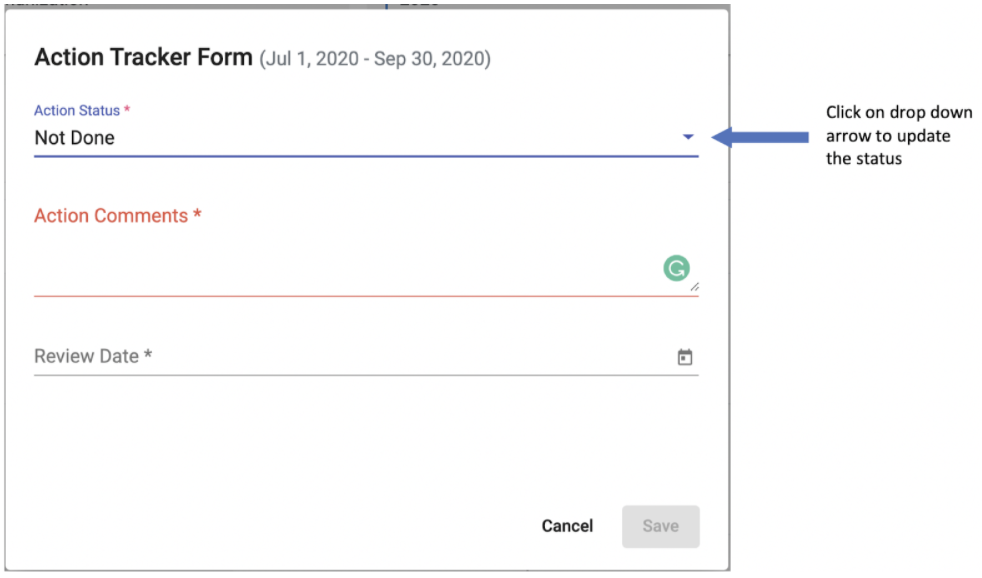{width=50%}

Select the current status of the action from the drop down list

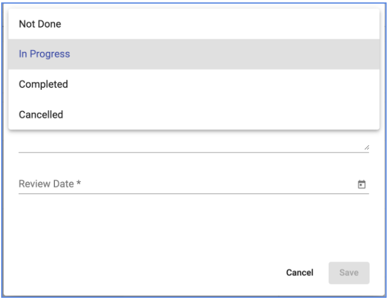{width=50%}

## Action Comments

Type in the Action comments section to provide more description of the selected status.

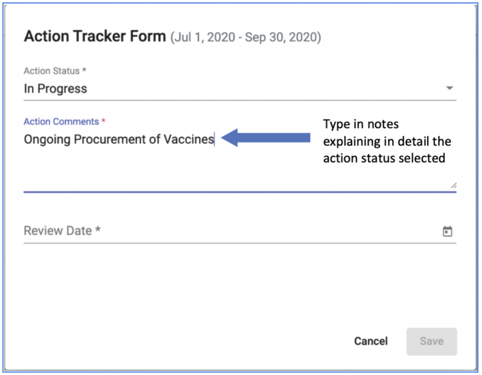{width=50%}

## Review Date

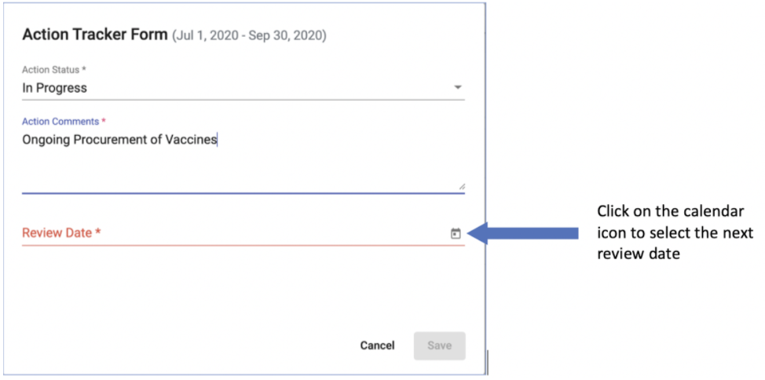{width=50%}

Select the date within the quarter when the action will next be reviewed.

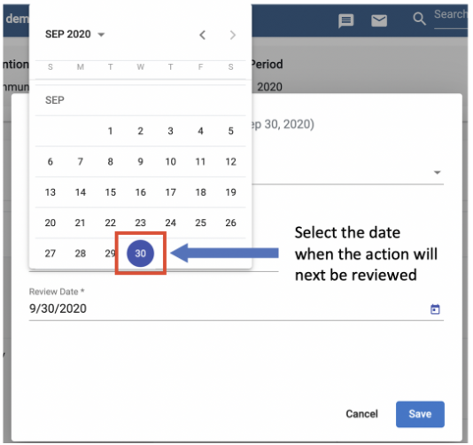{width=50%}

To save the updated action status. Click on the save button.

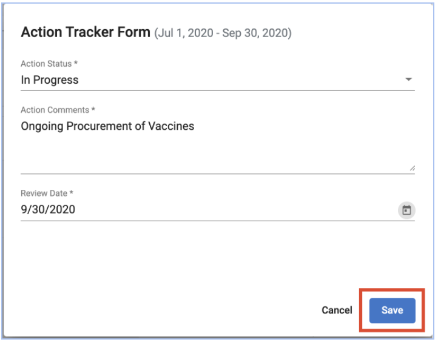{width=50%}

__Note:__

> The Save button is only activated when all the fields have been filled.

## Selecting Columns to be Displayed on the Table

To select columns to be displayed on the action tracking table, click on the list icon in the right corner above the table.

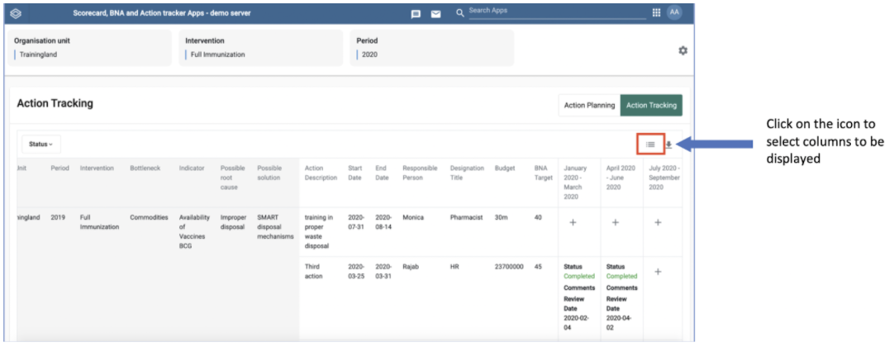{width=50%}

Check the boxes for the columns to be displayed on the table.

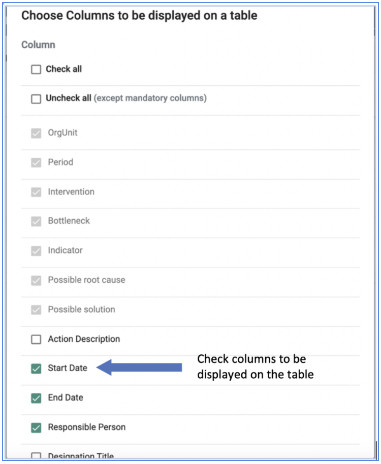{width=50%}

__Note:__

> Mandatory columns cannot be unchecked and will always be displayed on the table.

## Download List of Actions

To download list of actions tracked click on the export icon to get options of formats to download

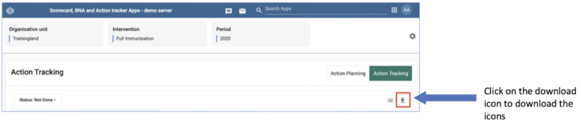{width=50%}

Select the preferred file format to download and follow steps on your browser for saving downloaded files. Available formats for download include CVS, Excel and PDF

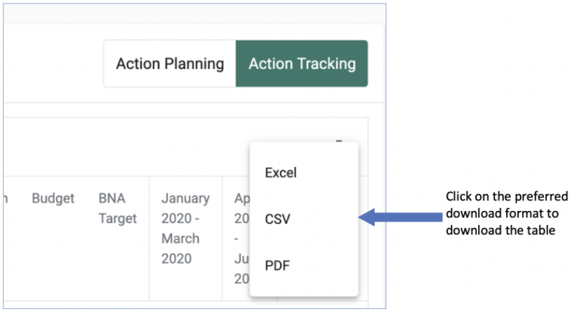{width=50%}

## Filter Actions

This allows one to select and display only actions of a particular status; not done, in progress, completed or cancelled in the table. To filter Actions to display in the table. Click on the status tab at the left upper side of the table.

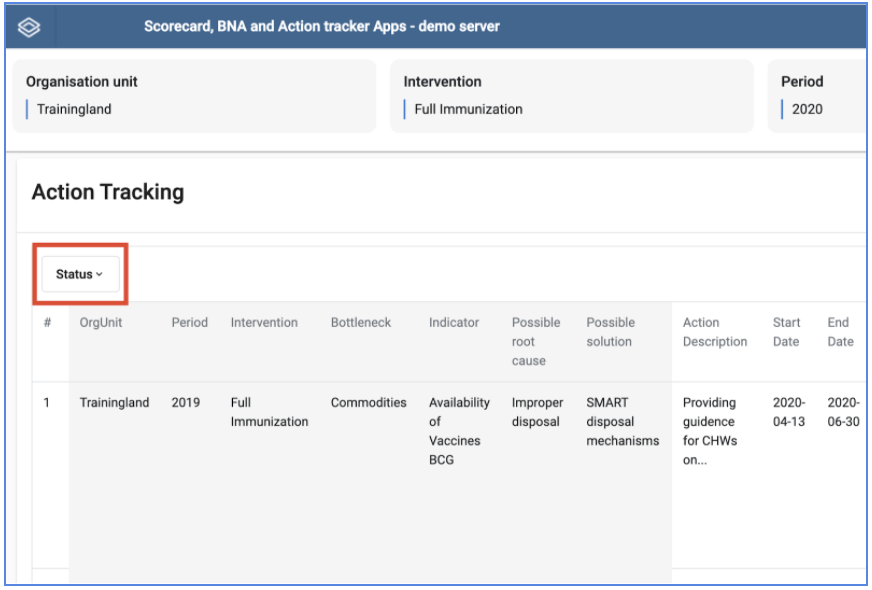{width=50%}

Select the preferred status; not done, in progress, completed or cancelled from the drop down list. This will only display actions of the selected status
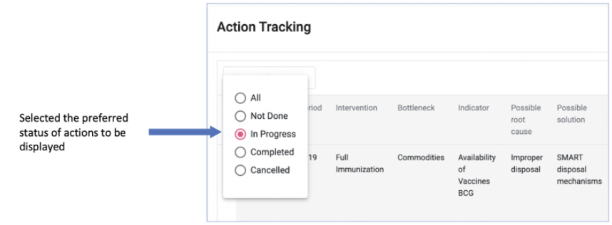{width=50%}
