## Browsing the Action Tracker

To browse the action tracker app, access the DHIS2 demo server with the login
credentials provided on the page. Once logged in, search for Action Tracker on
the Search bar.

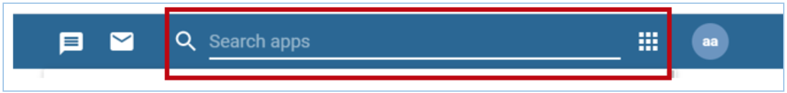{width=60%}

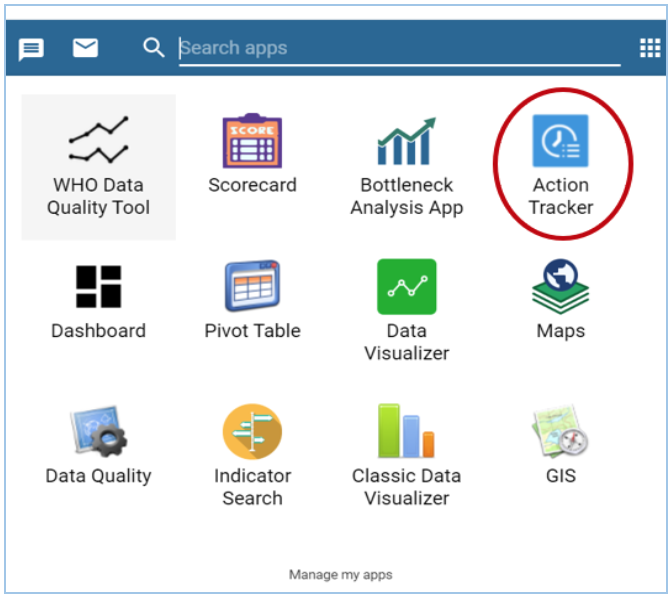{width=60%}

Click on the Action Tracker to load the Action Tracker App and once loaded, the
user can select the intervention, period, organization unit or modify legend
accordingly;

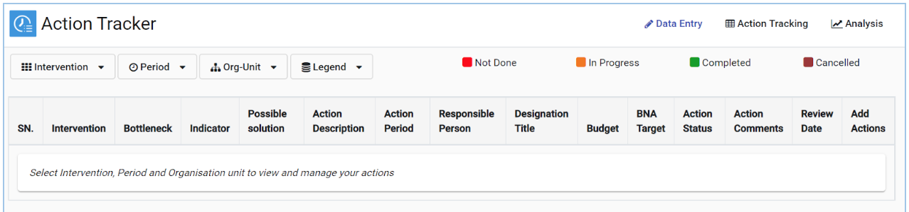{width=70%}

### Selection of an Intervention

The user needs to select the intervention on which bottleneck analysis and root cause analysis were performed and would now like to track actions to improve that particular intervention.

1. Click on the intervention tab to display a list of all available interventions.
   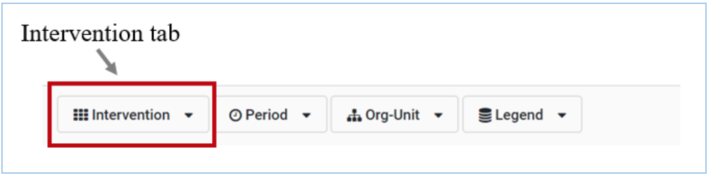{width=50%}

2. Click on the intervention for which a bottleneck was identified. This intervention will be selected and displayed to the right.

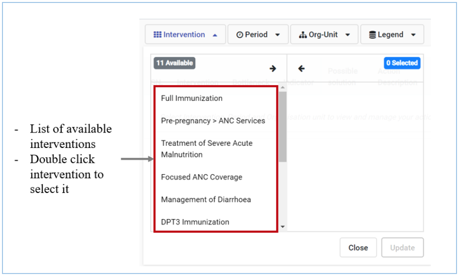{width=50%}

3. Click update to save the intervention

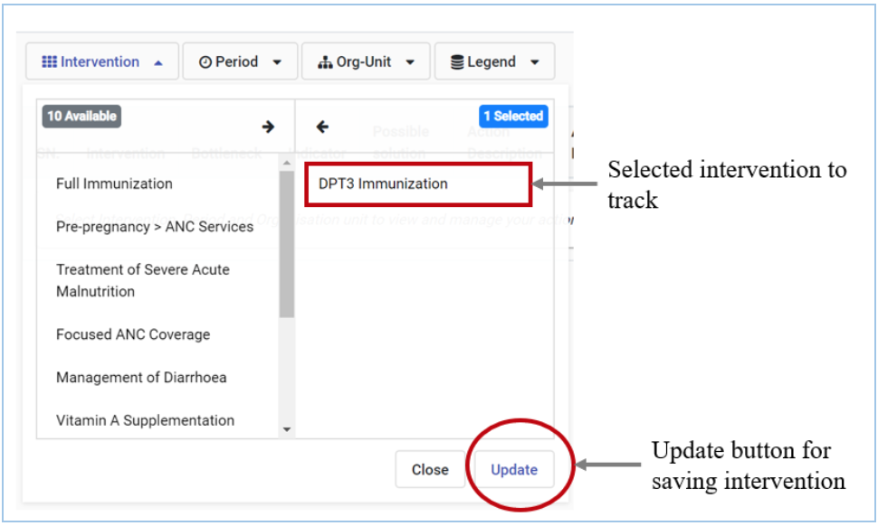{width=50%}

> __NOTE__
> Selection of the wrong intervention will not display the Root Cause Analysis data on the Action Tracker.

### Period Selection

The Action Tracker allows you to make period selections for fixed periods, relative periods and extended relative periods. All period selections types begin with clicking the period tab.

Click on the period tab to display the options
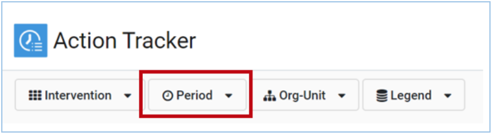{width=60%}

Click on the period type to select the desired type of period; either fixed periods or relative periods

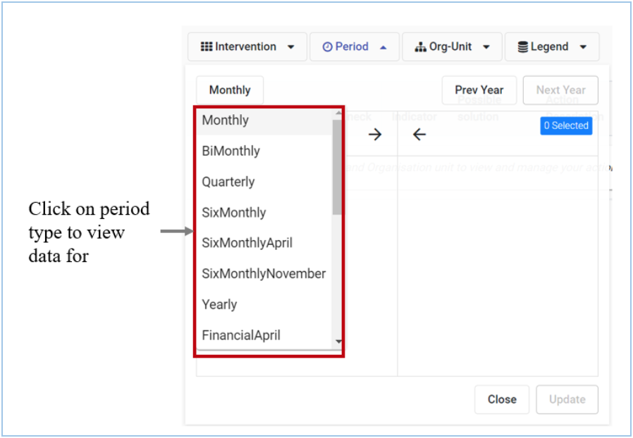{width=60%}

Select the desired period. This will appear to the right
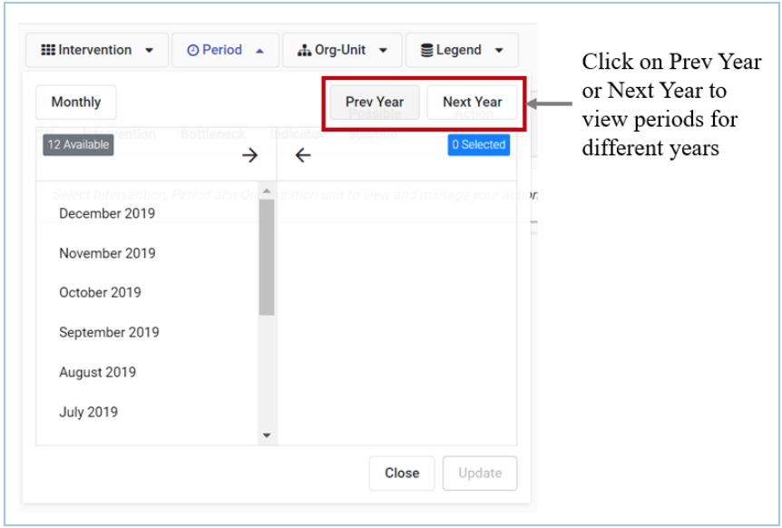{width=60%}

### Organization Unit Selection

The orgunit selection allows you to select the org unit level for which actions will be tracked. This is the same level for which the root cause analysis was done.

Click on the Org unit tab to access organization unit selection options

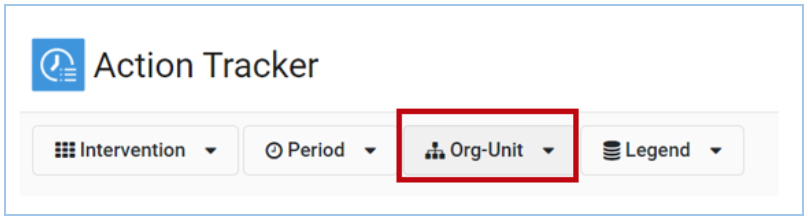{width=60%}

Select the desired Orgunit  level

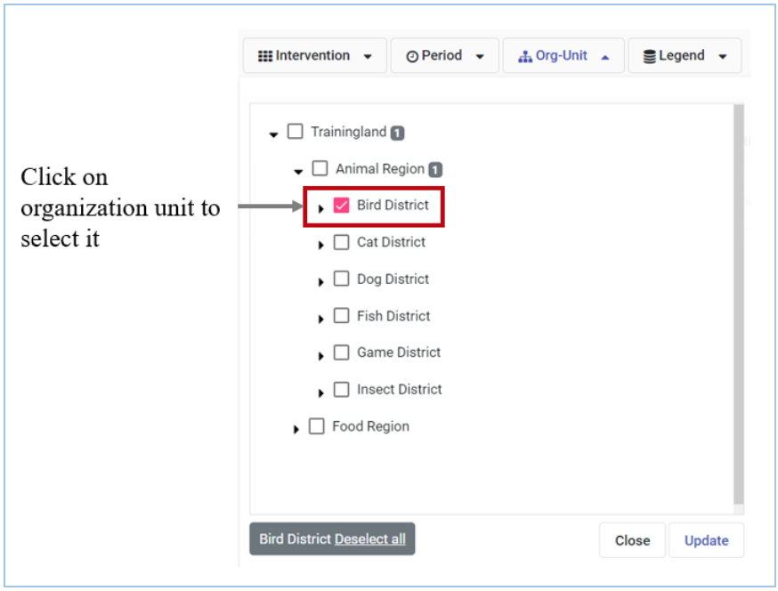{width=60%}

Click update to save the selected Orgunit level

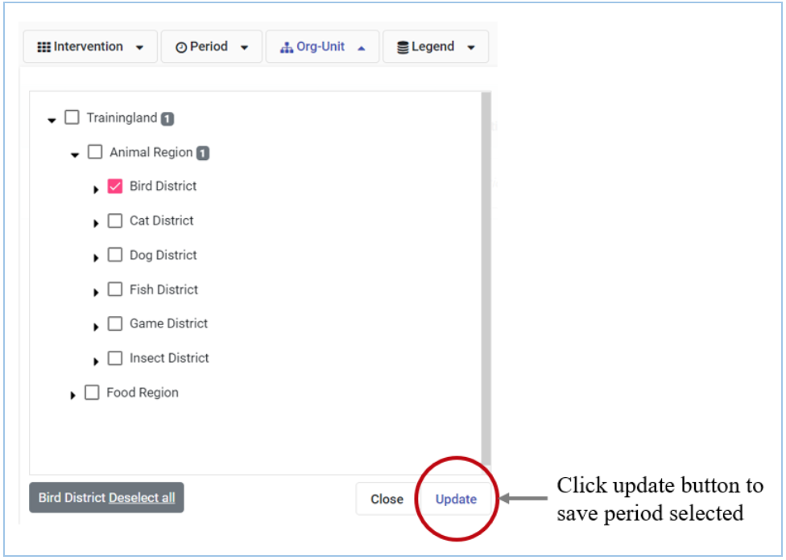{width=60%}

> __NOTE__
> Selection of the wrong organization unit level will not display the Root Cause Analysis data on the Action Tracker

Once the organization unit is selected and saved, data from the root cause analysis table is retrieved and the data entry module activated to allow entry and editing of the action tracker.

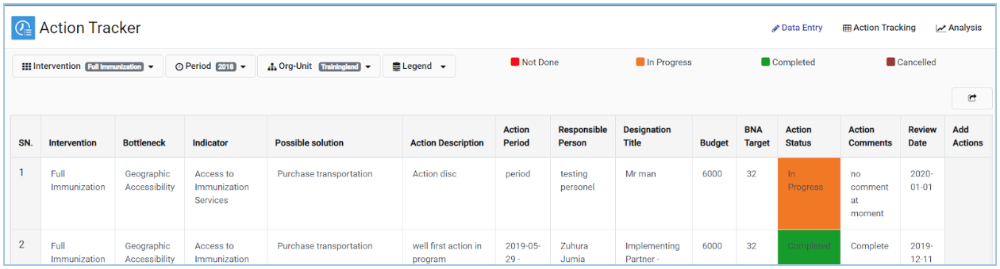{width=60%}

### Action Status Settings Configurations

The user can modify the legend based on the number of stages for tracking the action status. Currently the Action Tracker has 4 colour codes which indicate the levels through which the actions are tracked; Maroon indicates “Cancelled”, Yellow indicates “In Progress”, Green indicated “Completed”, Red indicates the action was “Not Done.”

Click on the settings icon in the right upper corner to edit the action status settings
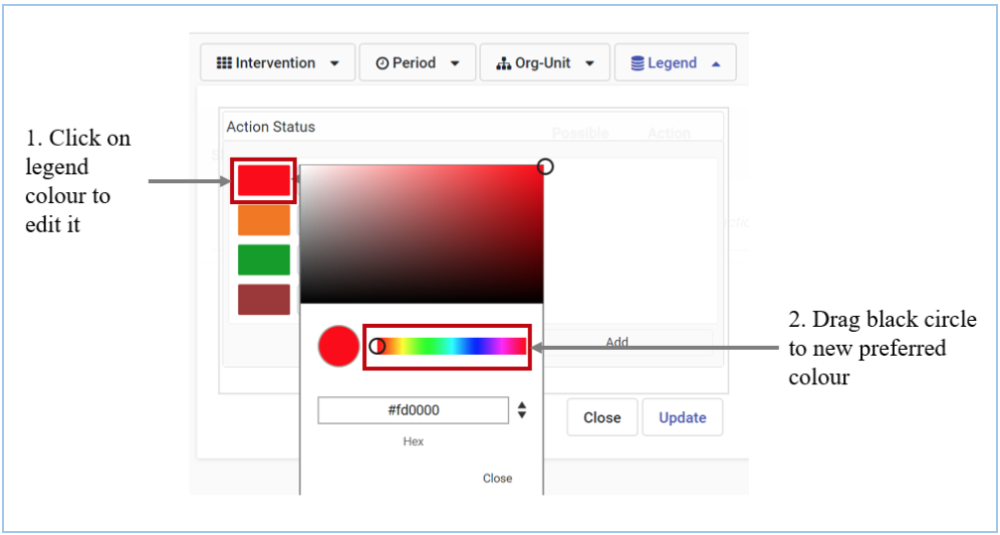{width=40%}

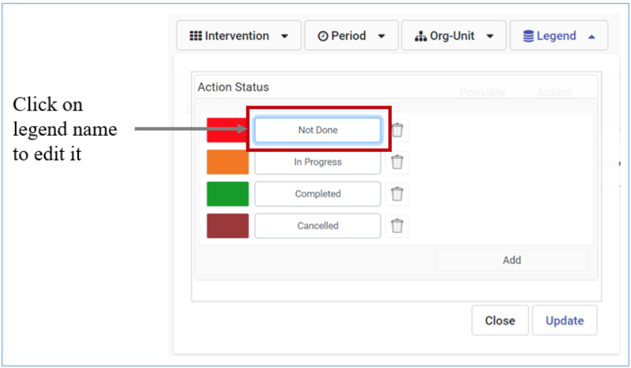{width=40%}

Click on the colour tabs to edit the colours

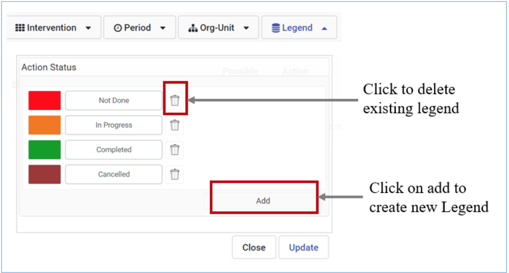{width=40%}

Edit the legend to the desired legend name.

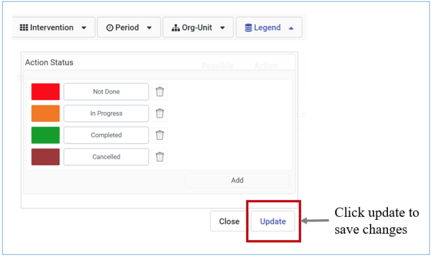{width=40%}

Set default legend by clicking on the pin. The pin will turn green. This will be the legend that appears once you start action tracking

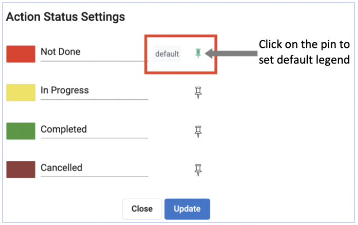{width=40%}

Click update to save the changes made to the legend

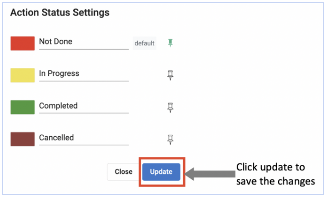{width=40%}

__Note:__ 

> Access to configuration of legends depends on user’s access roles

### 1.5.3 Mandatory Field Settings Configurations

Click on the settings icon in the right upper corner to edit the Mandatory Fields settings

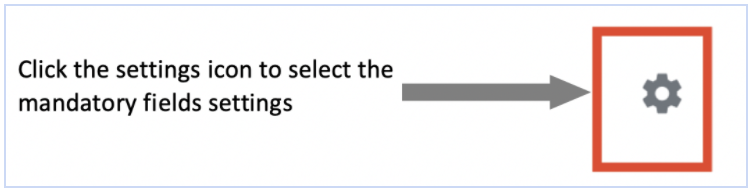{width=40%}

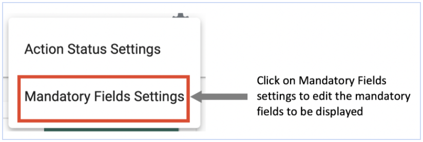{width=50%}

Select the mandatory fields that should be displayed on the list during Action tracking.

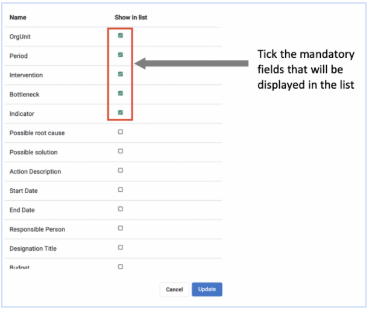{width=50%}

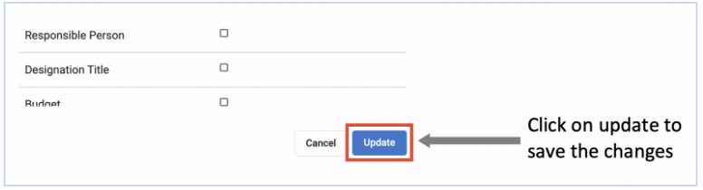{width=50%}

__Note:__ 

> Access to configuration of Mandatory Field Settings depends on user’s access roles.
