# Chapter 2. Data Entry in Action Tracker
The data entry section allows you to record actions aimed at addressing the root
causes of bottlenecks in the different determinants of health coverage. It
provides a description of the actions required to address a specific problem,
states the period within which this action should be done, responsible person,
status of completion, review date and provides for any review notes.

## 2.1 Data Entry
To access Data entry options click on Data entry tab
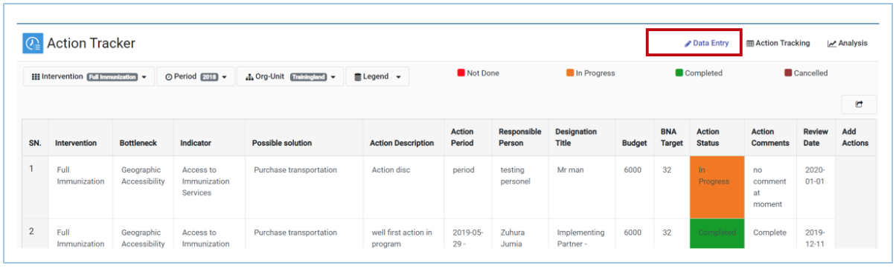{width=80%}
To access option for adding new action, right click on the intervention on Add
Actions column
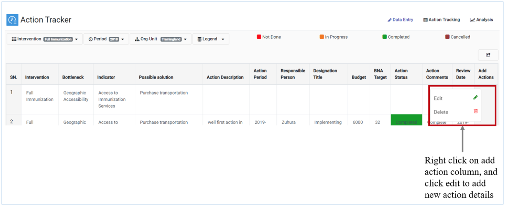{width=80%}
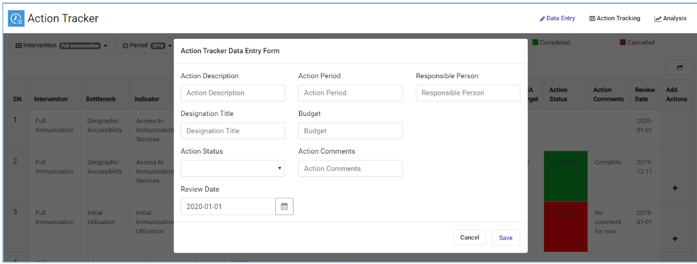{width=80%}

### 2.1.1 Action Description
This field (see Figure 2.1-C above) allows you to describe in detail the
specific actions that will be taken to arrive at the proposed solution. The
action recorded should be clear and specific. Only one action should be recorded
and in case the proposed solution requires more than one, then another action is
recorded as indicated in 2.1.B above.

### 2.1.2 Action Period
This field  (see Figure 2.1-C above) is for the period over which it is
anticipated that the action will be performed.

Once all the fields on  Figure 2.1-C above  have been filled, click on “update”
to save the information in the action tracker.
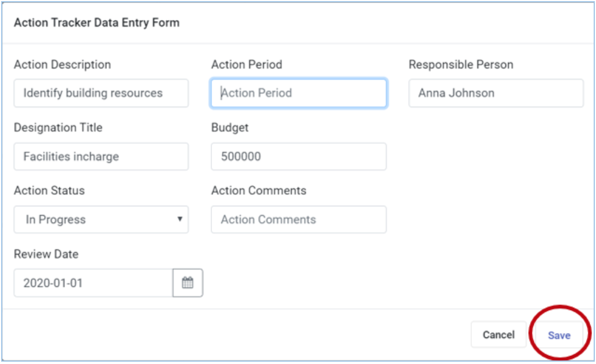{width=60%}

### 2.1.3 Adding Actions
In cases where the possible solution requires more than one action, additional
actions can be added using the add button in the last column to the right.  
Click the {width=7%} icon to add more actions
to the proposed solution. Once the fields are filled, save to continue.  
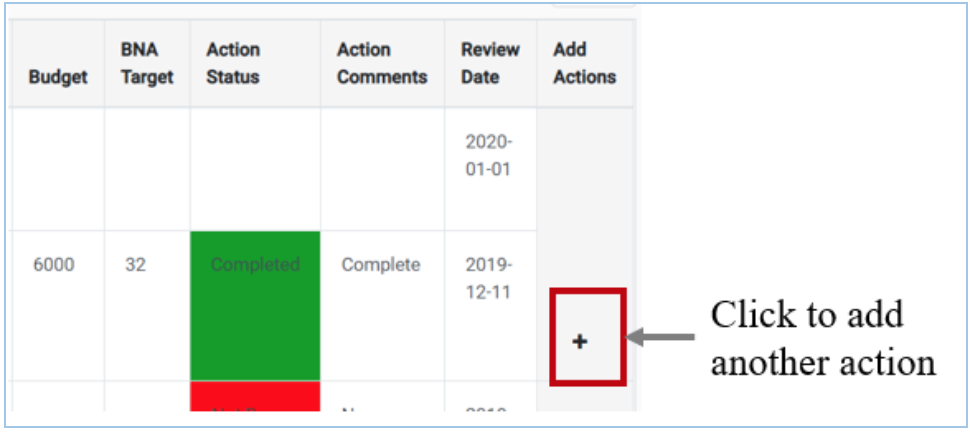{width=60%}

## 2.1.4 Edit or Delete a Field
To Edit or Delete an entry, right click on any cell for a given intervention and
edit or delete an entry accordingly.

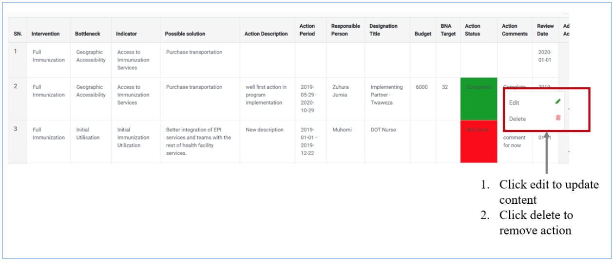{width=60%}
To edit the action, after clicking edit (Figure 2.1.2-A), update the data entry
field where you want to make changes then click save (Figure 2.1.2-B)

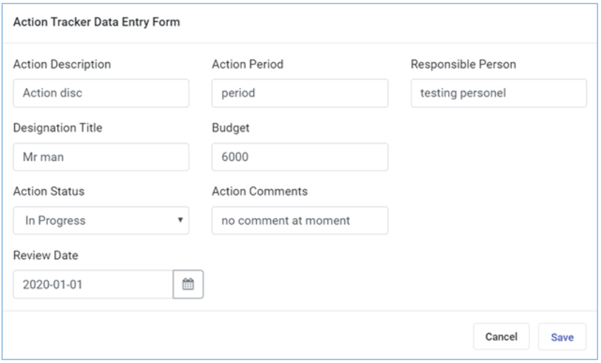{width=60%}
To delete the action, after clicking delete (Figure 2.1.2-A), click Yes if  
you are sure  you want to delete action or click No if you don’t want to delete
the action (Figure 2.1.2-C)
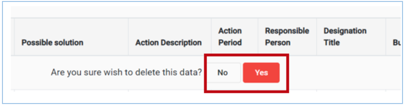{width=60%}

## 2.2 Actions Tracking
Actions can be tracked to see progress overtime and allow users to change
implementation status. To access the action tracking options, click on the
Action Tracking tab.

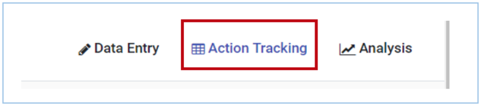{width=60%}

To download list of actions tracked click on the export icon to get options of
formats to download

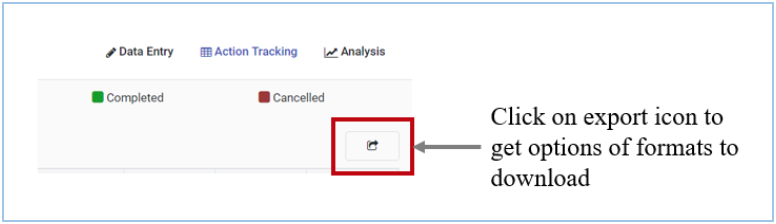{width=60%}

Select the preferred file format to download and follow steps on your browser
for saving downloaded files. Available formats for download include CVS,
Excel and PDF

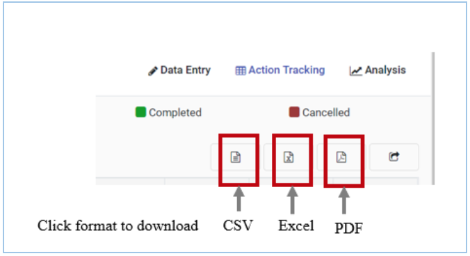{width=60%}

## 2.3 Analysis
The Action Tracker app includes options for view graphical presentations of the
actions tracked. To access the graphical presentation click on Analysis tab

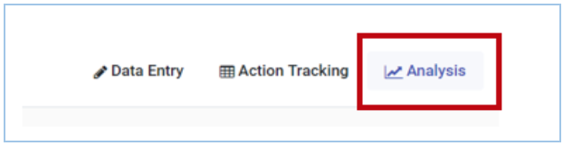{width=60%}
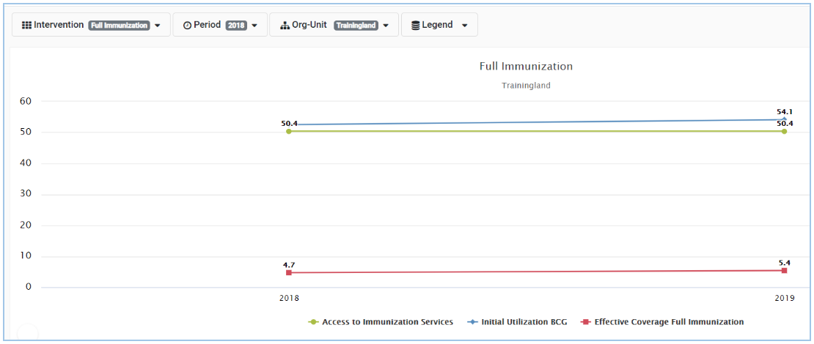{width=50%}
