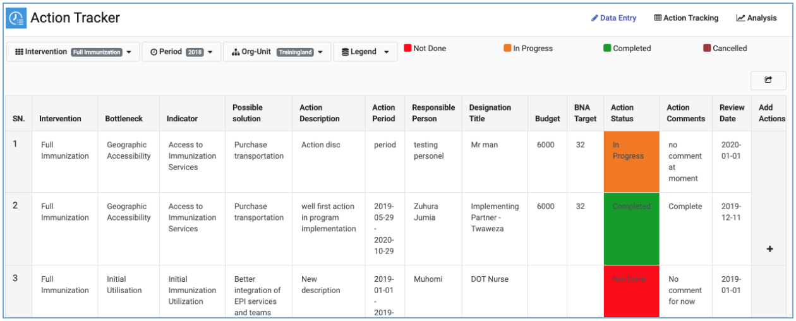
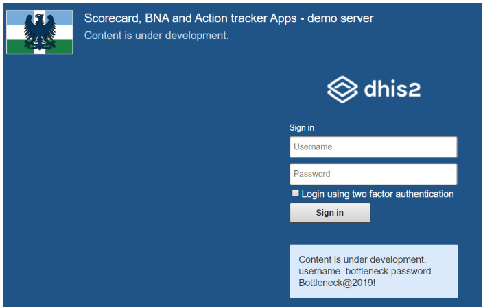

# Linked Action Tracker Dashboard and Demo server

## Introduction to the Action Tracker App

Action Tracker is part of the bottleneck and scorecard cascade that utilizes
DHIS2 analytical features to assess national and sub-national level performance
of key priority interventions aimed at improving health service delivery and
health outcomes. It is a tool that helps improve effective coverage of priority
interventions at sub-national level by tracking actions taken to address the
root causes of key bottlenecks in the health interventions.

The Action Tracker App is developed and maintained by the HISP Community
(University of Oslo (UiO), HISP-Tanzania and HISP Uganda) in collaboration with
UNICEF. The Action Tracker v1.0.0.rc.0 is available for download on the
[Dhis app store.](https://play.dhis2.org/appstore/)  It is currently compatible
with DHIS2 2.28 and above.   

{width=80%}

## Advantages of the Action Tracker App

The Action Tracker App helps track the status of key steps taken to address the
 root causes of key bottlenecks in priority interventions. It is built within
 DHIS2 along side the BNA, Scorecard and Root Cause analysis Apps allowing
 systematic analysis, status update and follow up of actions taken to address
 possible solutions to key bottlenecks in health service delivery.

## Rationale for the Linked Action Tracker App

The Linked Action Tracker enables health managers track progress on implementation
of actions for proposed solutions and allows for review and follow up of these
actions. Following the design of BNA, Scorecard and Root Cause Analysis Apps in
DHIS2, it was paramount to design the Action Tracker within DHIS2 to complete
the cascade of Bottle Neck Analysis.

> __NOTE__
> Linked Action Tracker App is dependent on BNA app implementation. All actions to be listed on Action Tracker App must be referencing bottlenecks identified using BNA app. You cannot implement Action Tracker App without a BNA app.

## 1.4 Accessing the Linked Action Tracker

This user guide is documented using the Linked Action Tracker App which is
available on the [DHIS2 demo server](https://scorecard-dev.dhis2.org/demo/).
The Action Tracker is set up in the DHIS2 Demo server and with linkages to the
BNA, Scorecard and Root Cause Analysis Apps. The current demo server can be
accessed on: <https://scorecard-dev.dhis2.org/demo/>
with the username and password provided on the login page.

{width=50%}

The server is hosted in the cloud and can be accessed on the internet via a
browser from anywhere as long as there is availability of internet.
