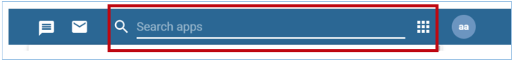
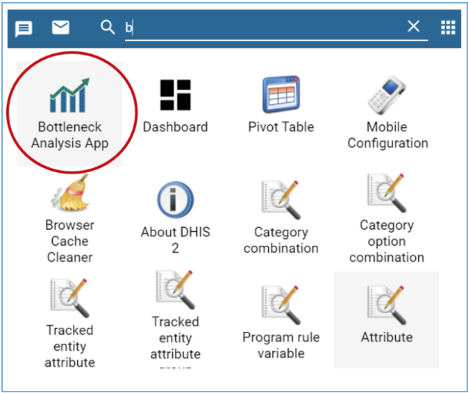
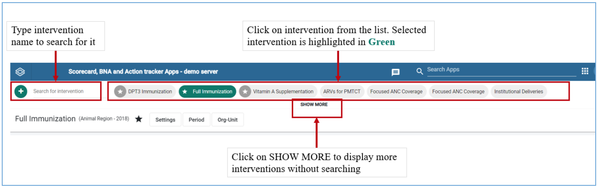
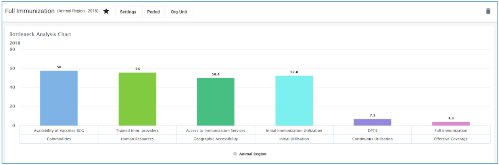
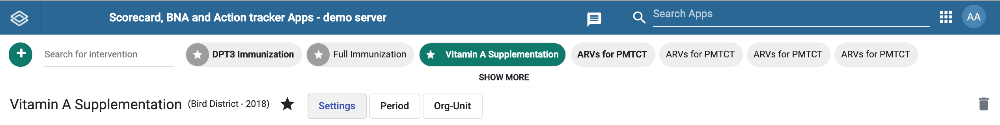

# BNA App architecture

The BNA Application is built on architecture that eases the user
interactions by having a design concept that promotes the user to follow
their intuition complemented with high performance that considers the
lowest internet connection scenarios with descriptive notification
messages if the user misses a step along the way.

## BNA App Design concepts

### Do more with less steps

Most of the operations in the application can be achieved in three steps
or less. The BNA App gives a district user or any user at any level with
no administrative privilege the ability to perform operations without a
need to switch between modules or drop ongoing activities. Users can
bookmark interventions, filter interventions by organization unit or
period and more with everything being just a click away.

### Trust your intuition

The BNA App has been built from the ground app, to make functionalities
more accessible, more intuitive and most importantly more capable. The
App follows a minimalistic design that minimizes any chances of the user
getting lost in the middle of performing their usual operations.

## Layout of the BNA App

The BNA App is flexible to adapt to any number of user journeys depending on the
country's implementations. The primary two users are:

1. **_Administrators:_** can manage interventions with operations such as creating
interventions, applying data filters for interventions, making legend definitions
and many more administrative operations.
2. **_District users:_** analyzing the bottlenecks can switch through their
interventions, bookmark their favorite interventions and perform root cause
analysis through the root cause analysis widget.

Other bottleneck App users can be national, and regional/counties  users who
can only analyse bottlenecks, sub-nation analysis, route causes for each
bottleneck and their solutions.

## Global DHIS2 Menu

To browse the BNA app, access the DHIS2 demo server with the login credentials
provided on the page. Once logged in, search for Bottleneck Analysis App on the
Search bar.

(width=50%)

Search for Bottleneck Analysis application and click on it

## Interventions list

Upon loading the BNA App, users will have access to available interventions and an option to search for more interventions which may not be displayed upon loading. Accessing the shared interventions is limited to the access level they are shared.

## Interventions Global filters

Right under the interventions list there are controls for the active
interventions. The filter control when clicked expands to offer the user
an ability to make data selections, period selections, organisation unit
selections, and legend configurations. However, all users except
administrators have access to Period Organisation unit filters only.
More details on these operations can be found on chapter 4 section 4.

## Intervention items

All interventions in the BNA App contains three items, namely:

1.  The Bottleneck Analysis Chart
2.  The Sublevel Analysis Table
3.  The Root Cause Analysis Widget

These intervention items will be empty when an intervention is created.
The administrator is expected to configure the intervention items by
making selections on the global filters. More details on how to
configure interventions can be found on Chapter 4 Section 5. The
district user is expected to enter data into the root cause analysis
widget as explained in the next chapters.
