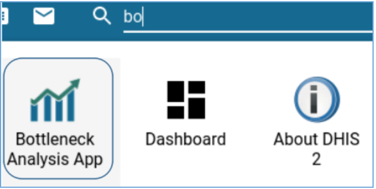
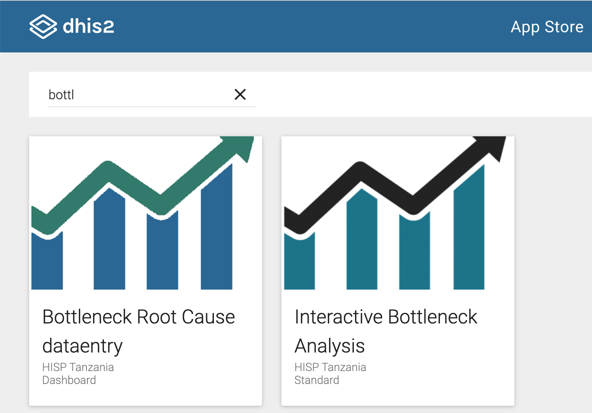
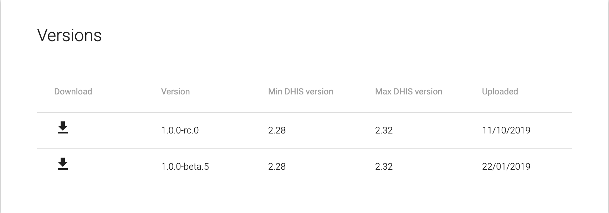
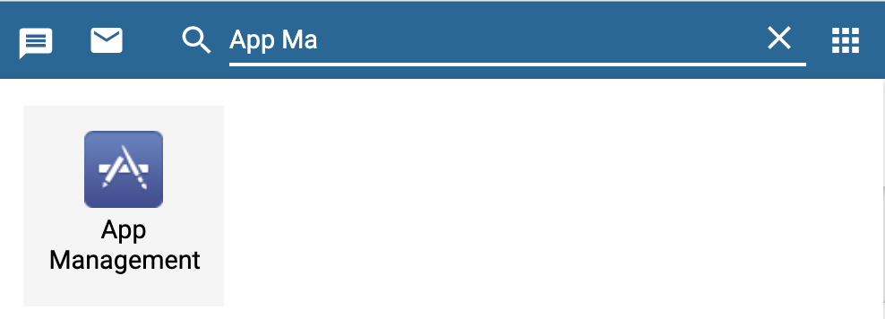
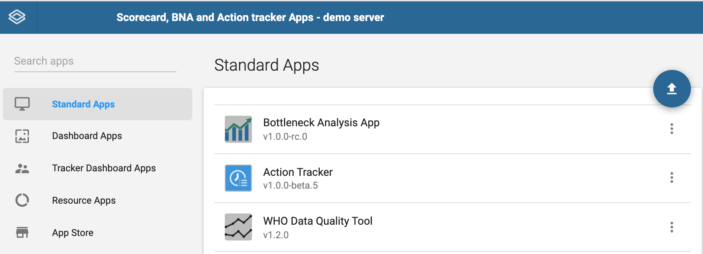

# Installing the BNA App

The BNA app is completely free and open source and available on the
[DHIS2 app store](https://apps.dhis2.org/).

To install an application in DHIS2, you require the superuser privilege.
Ensure your account has the necessary authority to install the application or
contact your DHIS2 support team for support in installing the app.			

> **NOTE**
>
> Interactive BNA app supports all versions of DHIS2 from 2.28 going upward,
It can run in lower versions limited functionalities and with no support for
fixing any issues.

There are two ways of installing bottleneck analysis app into your
DHIS2 instance.

## Installation from within DHIS2

This installation approach is the most direct, but only available on
DHIS2 running version 2.28 and above

Step 1:  Access app management from the apps selection menu

{width=50%}

Step 2: Once Apps management is open:
Go to the apps store panel and the list of online applications for installation
will show up.
Install the “Interactive Bottleneck Analysis” app and the “Bottleneck analysis”
app by clicking on install underneath the app name.

{width=70%}

When done installing, the BNA App will be accessible from the search menu.
Note: This step is only successful if you have an internet connection and your
DHIS2 instance is accessible online.

## Installation from DHIS2 App store website

Access the interactive bottleneck analysis and bottleneck root cause data entry
apps from the [DHIS2 app store](https://apps.dhis2.org/). This approach
is recommended for all DHIS2 instances running on version 2.28 and above.

> **NOTE**
>
> Ensure that you have good and stable internet connection to download the
zip file. During installation, both the Root Cause and Interactive apps have to
be downloaded and installed.

{width=50%}

Step 1: Downloading  a compatible version from the app store
Once on the DHIS2 App store locate the BNA applications and select them to get
the list of available versions of the app. Select the latest version of the app
and download a zip file of the latest build into your local hard disk.

{width=70%}

> **NOTE**
>
> The zip file name may have a cryptic alphanumeric name such as
“727a1631-85e4-4313-be1f-b5f02f7e25e2”. You may want to rename the zip file to
easily locate it in the future with naming such as “Bottleneck App v1.0x.beta.zip”,
where “x” is version number of your build.

Step 2:  Access app management from the apps selection menu

{width=70%}

Open Apps management to see and manage list of installed applications on DHIS2,
bottleneck app can be installed by clicking the upload icon.

{width=5%}

Once installed the bottleneck analysis application will be enlisted under
standard apps

{width=70%}

When done installing, the bottleneck app will be accessible from the search menu.
If the bottleneck analysis app does not appear on your menu, it could be a result
of the following two issues.

1. Installation Access credentials/Permissions
  While the bottleneck analysis application may be installed within your DHIS2
	instances, you may not have the necessary permissions to view it. In these cases,
	communicate with your DHIS2 administrator or DHIS2 support team for the application
	to be assigned to one of your user roles.

2. Installation not successful
	 The bottleneck analysis application will not be visible in your application
	 if it has not been installed successfully. 			

	 > **NOTE**
	 >
	 >Most common failures related to installation results from
 misconfiguration of read/write permissions of the installation folder on the
 server hosting DHIS2 instance. Misconfiguration of permission can also result
 from denial of ability to delete an installed application.			

To resolve this, the administrator needs to access the back-end of DHIS2,
to assign proper ownership and read-write permission of the folder for holding
installed apps.			

> **NOTE**
>
>The location of the folder for installed apps varies depending on the
version of DHIS2 Installation.

1. From version 2.27 going back, the folder for installed apps is located in
   [DHIS2_HOME]/apps
2. From version 2.28 and above, the folder for installed apps is located in
   [DHIS2_HOME]/files/apps		
For more information on how to create and install applications on DHIS2
please visit https://www.dhis2.org/how-to-create-find-install-apps/ 		
