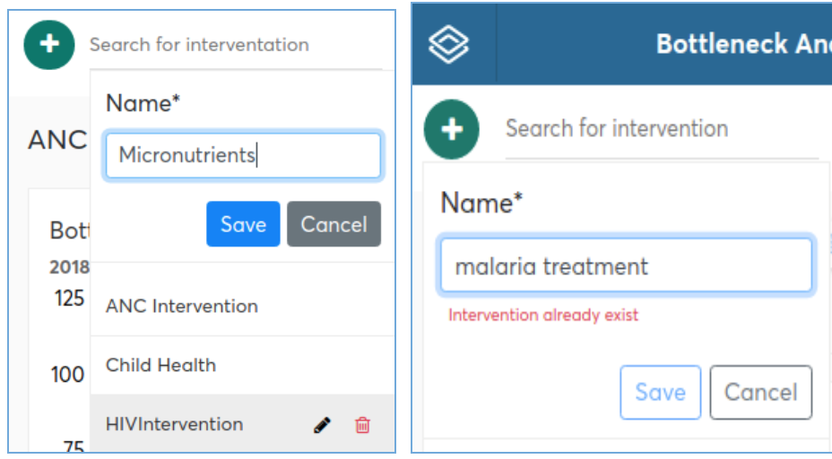
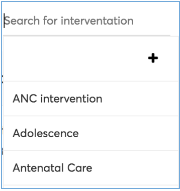
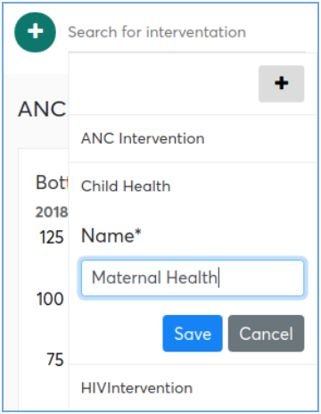

# BNA App Maintenance

##Maintaining Interventions

BNA Application allows users with administrative privileges to create, rename,
organize (laying out), or delete interventions.

###Creating an Intervention

As an administrator, you can create new interventions in the BNA Application and
 save them. This is applicable when there is a new intervention to be added in
 the BNA application. Any attempt to create an intervention with the same name
 as any existing intervention, administrator will be given an error message about
the existence of the intervention name and it will refuse creating it.  To create
an intervention, the following procedures are to be followed:
1. Click the dark green plus sign below the banner of the system.
2. Click the plus sign displayed below the dark green plus icon you have
previously clicked.
3. Type the name of the intervention in the input section and click ‘Save’
button to complete creating an intervention or cancel to revert.

###Searching for Interventions

Once the BNA App is open the list of configured interventions will be shown on
the pill buttons with the active one highlighted in color green. The user can
navigate to the intervention they prefer, however for administrative users who
set up the interventions of the LGA are represented with an area to search for
interventions found at the leftmost top area of their screens.

###Renaming an Intervention

BNA Application allows users with administrative privileges to rename the
existing interventions in the system with the new names. Renaming of intervention
 is important especially when program decided to change the intervention name
 while maintaining all the indicators and configurations associated with it.
 To rename intervention in the BNA App, you do the following:
1. Go to search area alongside interventions to access the list of interventions
 in the system.
2. From listed interventions below search box, go to specific intervention and
click on the editing icon.
3. Replace the existing name with the new one.
4. Click the Save button to save changes.

###Access sharing/control

An administrative user of BNA App can choose to share their interventions,
its very easy to share the interventions that they have configured.
The BNA App gives the administrator an ability to set sharing who has access
to the configured interventions and the privilege (view only or edit) to the
particular group of people that they share with.
Sharing of the configured intervention can be done through the share icon found
just below the list of interventions and next to the name of the existing
currently active intervention.

 Clicking the icon gives a list of user groups that the user can share interventions
 with by clicking an image representing a privilege for a group of interest.
 The administrator is not limited to using only user groups but could also share
 the interventions with individual users. When a privilege has been chosen for
 a group the color of the icon of the privilege will change to notify that the
 particular group has been access to the intervention.

> **CAUTION**
>
> Sharing settings from 2.28 going back is only implemented on the
interface, access control is not strictly enforced, it is for simplicity in
management of BNA Interventions only through the datastore.
> **NOTE**
>
>User groups appearing on the access sharing list should exist in the user
groups that were created in the “Users” app.

###Bookmark an Intervention

To bookmark an intervention an administrative user will have to simply head on
to the control options found just below the list of interventions next to the
share icon there is a bookmark icon. Clicking the icon will bookmark the dashboard
that you are currently viewing. The name of the dashboard you are currently viewing
is also displayed on this control area.

###Deleting an Intervention

The BNA App allows deletion  of an intervention from the system whenever necessary.
Deleting intervention means you delete all indicators, bottleneck charts, sub-level
analysis and root cause analysis created under that intervention. This is why before
deleting, you will be asked to confirm if you are sure you want to delete it,
where you will click “yes” to delete or “no” to cancel.
To delete an intervention, the administrative user can:
1. Go to search for intervention just allocated on the right hand side of
adding new intervention icon and
2. click the delete icon next to edit button on the the specific intervention.
3. Select an intervention from the list, and click “DELETE” button on the far
right side of the App and confirming deletion by clicking ‘yes’ option.

##BNA Widgets setup

###Accessing Widgets

BNA Widgets are meant to mainly be accessed by users at district levels.
Widget is a separate application that is installed in DHIS2 instance to work with
BNA Application. In case you don't find it in your DHIS2 instance, go to
App Management in the DHIS2 global menu to install it.

###Setting up Widgets

At first glance, when the administrator has installed the BNA Application into
a clean instance the root cause analysis data entry component of the intervention
will display a message prompting the user to head over to the DHIS2 Appstore and
download the “Root Cause Analysis Data Entry Widget”.
Detailed information on how to install an application from the DHIS2 app store
can be found in chapter 2.

If BNA application is taking too long to load, and you’re not on a slow
network, make sure you have cleared your browser cache.

BNA Application makes good use of cached files for better offline
experience, as a result, when installing higher version, BNA Application
may use older version of cached files and thus break down while loading.

## Clearing application cache

Approaches to clear application cache and browser interface, vary from
browser to browser; for example for Mozilla Firefox the keyboard
shortcut is “CTRL+SHIFT+DELETE” while for Google chrome the keyboard
shortcut is “CTRL+SHIFT+J”.

Accessing interface for clearing browser cache can be done via the
following approaches:               • Google chrome​: Go to the menu
icon on the top right corner, and click it to open, go to more tools
menu, and choose “Clear browsing data”. Once interface is open, Make
sure, “Clear the following items from” is set to “The beginning of
time”.                                 

• Mozilla Firefox​: Go to the menu icon on the top right corner, and
click it to open, go to -\>Library, and go to History, and choose “Clear
recent history”. Once interface is open, Make sure “Time range to clear”
is set to “Everything”, and “Details” option is expanded to show all
details options. Once on the clear browsing data or recent history, tick
“Cache”, “Cookies”, “Hosted app data” or “Offline Website data”. To
clear all cached files, cookies and locally stored data by bottleneck
.        

 

> **NOTE**
>
> These will also clear all cache information
and cookies from other websites you visited in your browser.

## BNA App Error Messages

The BNA Application has error messages for the expected errors that
could occur. For example attempting to access metadata that no longer
exists in the system.
