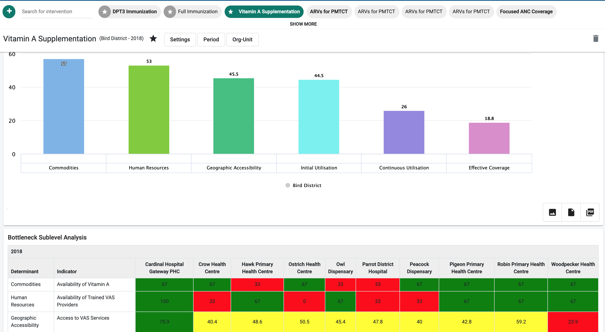

# Bottleneck Analysis Dashboard and Demo server

## Introduction to the BNA App

Bottleneck analysis (BNA) is a structured analysis of the determinants
of coverage for a wide range of interventions delivered through the
health sector, useful to supporting targeted operational planning. It is
a systematic, outcome-based approach to equitable health programming and
real-time monitoring that strengthens the health system, complementing
and building on what exists.

The BNA App is developed and maintained by the HISP Community (UiO,
HISP-Tanzania and HISP Uganda) in collaboration with UNICEF. The BNA app
is available
[here](https://apps.dhis2.org) for
download.  It is currently compatible with DHIS2 2.28 and above.   

## Rationale for the BNA App

Health managers have competing demands resulting in limited time,
resources and training to conduct data analysis. Collecting data from
multiple sources and preparing it for analysis themselves can be a
barrier to effectively using data for planning.  While the growing trend
of building dashboards into DHIS2 is encouraging, too often the
information displayed in dashboards is a collection of related (or
sometimes unrelated) indicators rather than a well thought out process
(or framework) of how a workflow or intervention actually works.  The
bottleneck analysis app helps address these issues by automating data
gathering and presentation within DHIS2 and displaying it in a manner
that facilitates systematic analysis for programming.

Effective and timely use of DHIS2 data by stakeholders at all levels of
health system is critical for health service delivery. DHIS2 dashboards
have the potential to enhance the use of data for decision making and
planning by displaying information for managers in an accessible and
actionable manner. This visualization is made possible by using the
bottleneck analysis model integrated with the causality and tracking
actions/solutions to effect interventions.

## Advantages of the BNA App

The bottleneck analysis and planning approach contribute to existing
national and sub-national planning and monitoring cycles by offering a
strategic, rapid and systematic approach to analyzing key health systems
barriers to reaching intervention coverage targets.

This approach can help save time and increase the efficiency of
resources available by identifying where the greatest pockets of unmet
needs or poor service outcomes exist and, in those places, identifying
key bottlenecks, prioritizing what should be addressed immediately, what
should be deferred (prioritization of most effective actions) and
ensuring that resources are programmed to tackle priority bottlenecks
with evidence-informed solutions.

## About demo server and the BNA App meta-data

The BNA demo server is setup to support both development, testing,
training and ensuring quality of features and functions of the demo
server. Additionally, the demo server is also setup to host both demo
data and metadata across various interventions to give chance to users
of the system to explore and learn system features and functions. The
current demo server can be accessed on :
[https://hisp.apps.dhis2.org/training/](https://hisp.apps.dhis2.org/training/)

The server is hosted in the cloud and can be accessed on the
internet via a browser from anywhere as long as there is availability
of internet.

### Accessing the BNA App                                           

This user guide is documented using the linked BNA App which is available on the
[DHIS2 demo server](https://hisp.apps.dhis2.org/training/). The BNA app is set
up in the DHIS2 Demo server and with linkages to the Scorecard, Root Cause
Analysis and Action Tracker Apps. The current demo server can be accessed
on: [https://hisp.apps.dhis2.org/training/](https://hisp.apps.dhis2.org/training/)
with the username and password provided on the login page..

### Indicator Management

The BNA app borrows its meta-data from the general DHIS2 data source and uses
this to create a data store for ease of analysis. Bottleneck analysis metadata
such as indicators and indicator groups are managed using the DHIS2 Indicator
maintenance App.

Complex indicators that require additional calculations are maintained
using the function maintenance app. These include but are not limited to
indicators on stock data, Human resources.

### Functional Maintenance App

The BNA App is also integrated with function maintenance App, used to
create custom indicators. Custom Indicators are indicators whose
definition and calculation cannot easily be created using the Indicator
maintenance app in the DHIS2. The app can be easily used by developers
to create custom codes to retrieve and  use indicators with complex
calculations. To use the app, find it
[here](https://apps.dhis2.org/)

