# BNA App interventions configurations

The BNA interventions management (settings) options are only available to users who are created with the administration privileges

Bottleneck analysis application can be found in the Apps menu. if the
application has not yet been installed in your DHIS2 instance or
installation has issues, refer to the installation instructions (Chapter
2) of this documentation for further guidance, or contact the
DHIS2 administrator for your instance.

{width=50%}

## Starting an Intervention

Once open, the bottleneck analysis application will bring a list of
created interventions, or when no intervention exists, a quick create
button will display for the user to create and add a new intervention.

The new intervention dashboard will display blank templates pending data
selection and filtering.                        

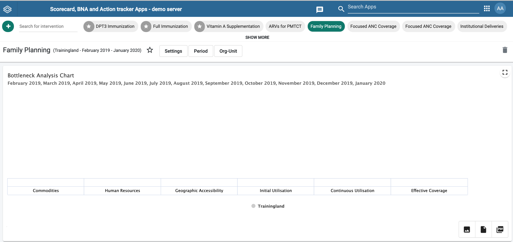

> **NOTE**
>
> If bottleneck analysis application is taking
too long to load, and you’re not slow on network, make sure you have
cleared your browser cache. See [BNA App Maintenance](#bna-app-maintenance) for
additional information on clearing browser cache.

The bottleneck app makes good use of cached files for better offline
experience, as a result, when installing higher versions, the bottleneck
app may use older version of cached files and thus break down while
loading.

## Intervention Settings
The administrator user can make data selections from the global filters by simply selecting Settings tab. Currently the  BNA Application supports data selections of Indicators and Functions. Clicking the Settings filter control opens a panel with a list of indicators complemented with a list of data dimension groups. When a user selects an indicator or a function from the list of available data items the selected data items will be populated to the active data dimension group.

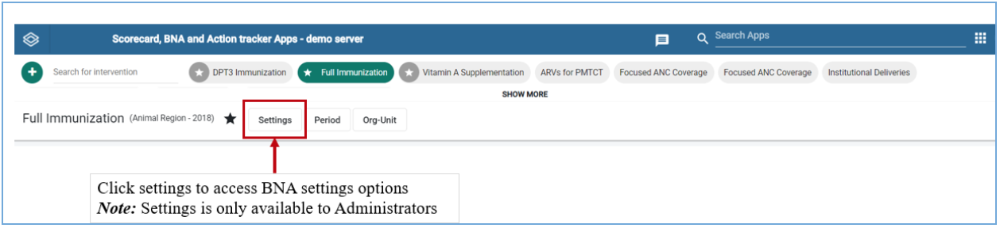

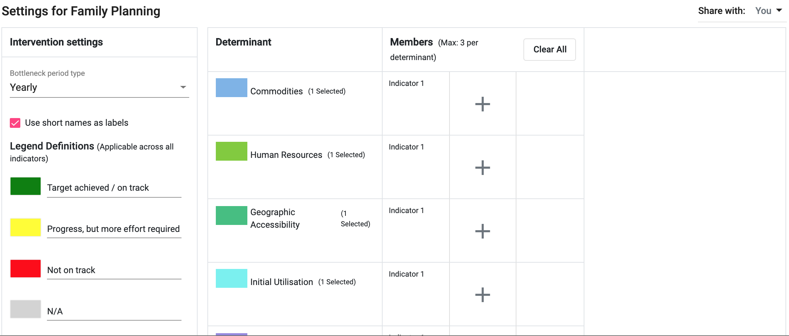{ width=70% } 

> **NOTE:**
> Long indicators can be shortened by entering alternative display names as indicated above. This will ensure your chart is readable and easily interpretable.

### Period configuration

Each intervention to be analyzed must be linked with a specific period for which the determinants members will be analyzed.

To access option for configuring period for intervention’s bottleneck analysis click on “Bottleneck period type”

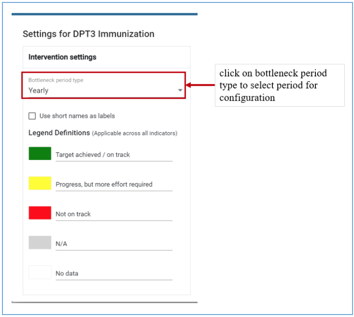

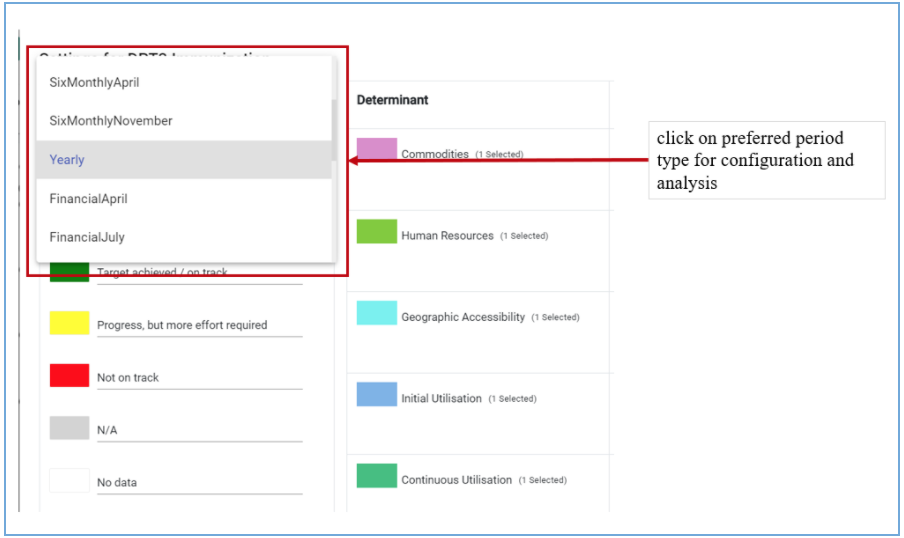

### Legend Configurations

The administrative user can set legend for each indicator in every intervention to show low, medium and high bands with their cut-off points. An administrator can set colors for each band for visualization. Currently the BNA App uses three classes of colors to present indicator performance as per defined cut-off points. Red shows low performance, with yellow and green showing medium and good performance respectively. To manage the Legend, the administrator must can legend label and colour

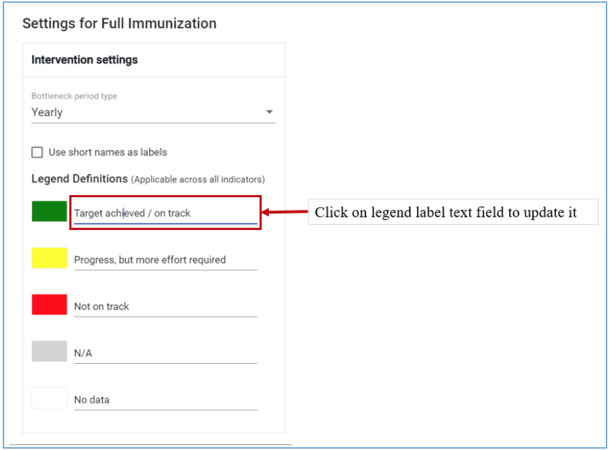

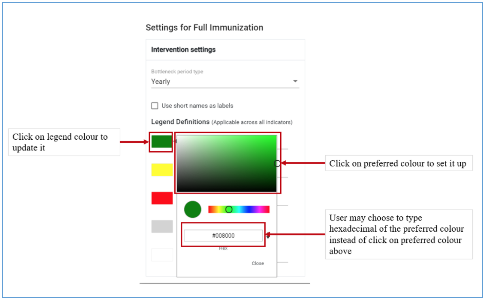

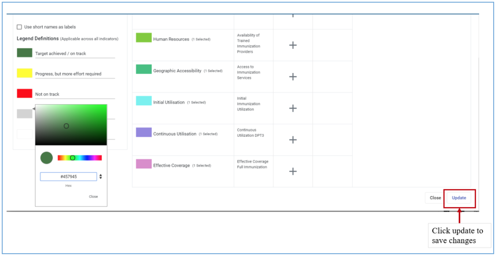

> **NOTE:**
> For any changes made, administrative user must click update button displayed in the working window and save changes for persistence, or just close the message in case of rejecting the changes

### Determinants members management

For each determinant (Commodities, Human resources, Geographic accessibility, Initial utilization and Continuous utilization) up to three members (indicators or functions) can be selected for analysis.

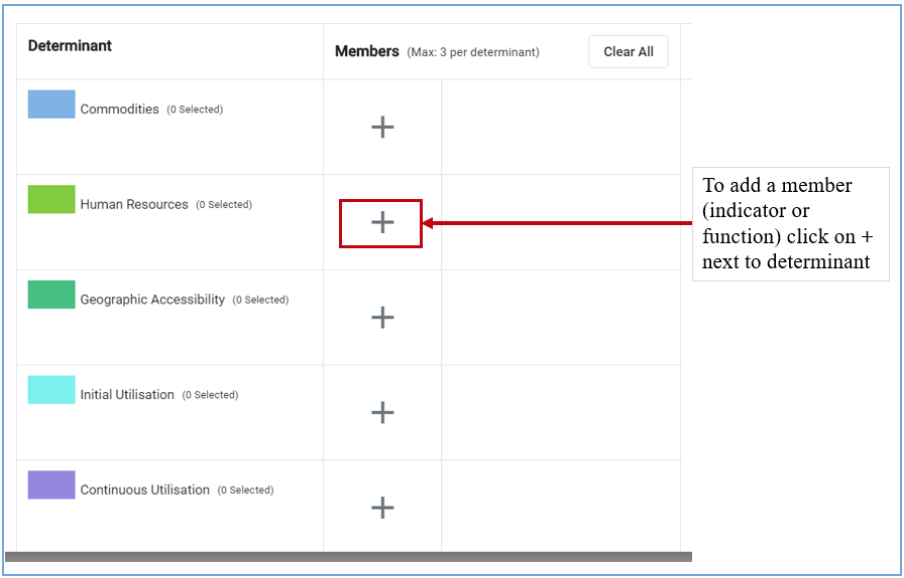

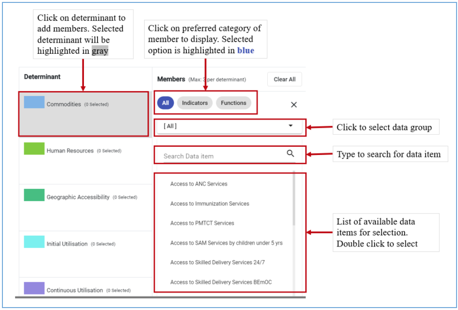

After selecting the member, the administrator will get options for further configuration of the member selected which includes defining display label and setting up minimum and maximum values for sub level analysis.

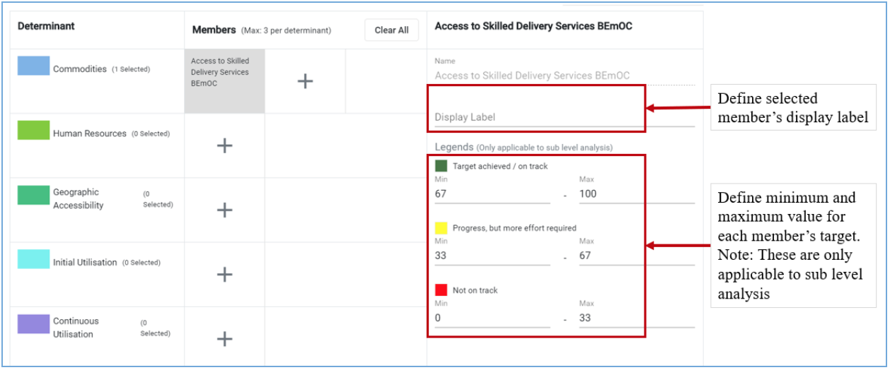

To save changes made, scroll to the bottom of the configuration screen and click Update

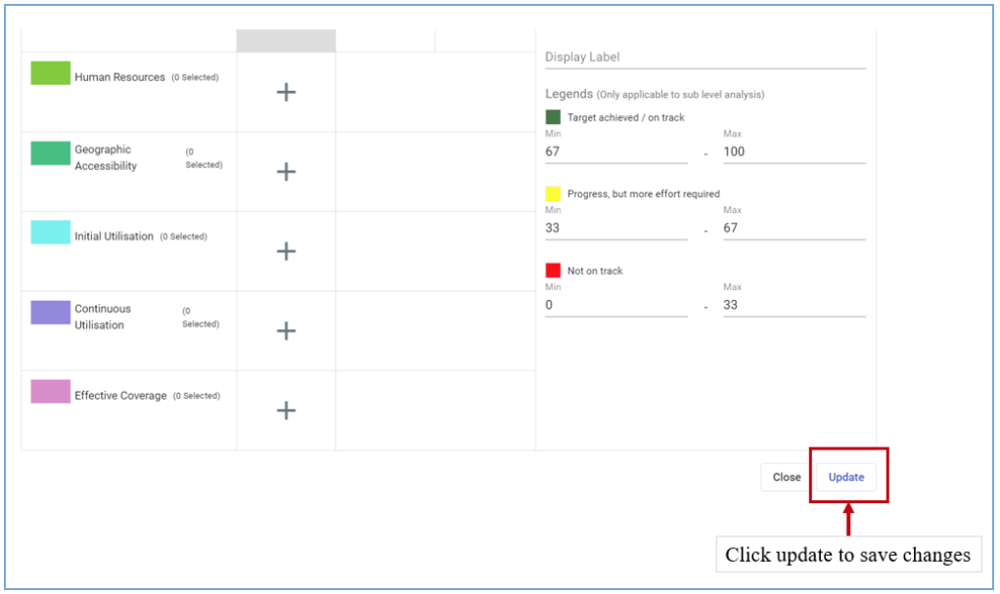

To add another member (maximum allowable is three) to the same determinant click on the + as shown on figure 3.2.3-E below

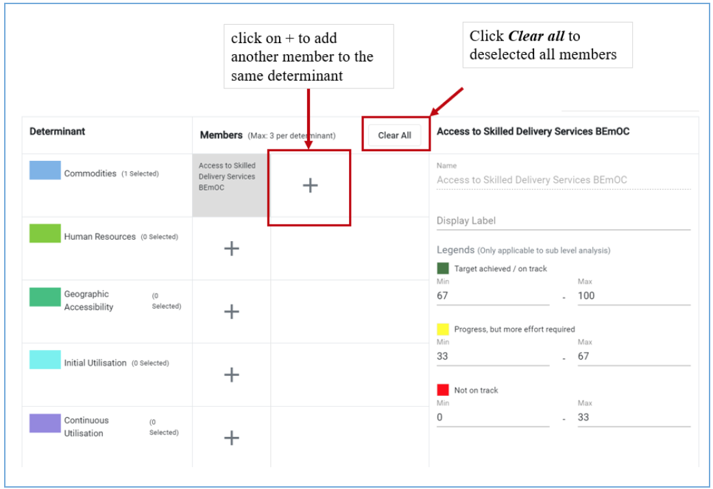

### Sharing interventions configuration settings

The defined interventions can be shared and made accessible to multiple users within the system. To share the intervention settings click on Share with option and define people or groups you want to share the configuration with. Only people or groups who will be selected will have access to the configured intervention

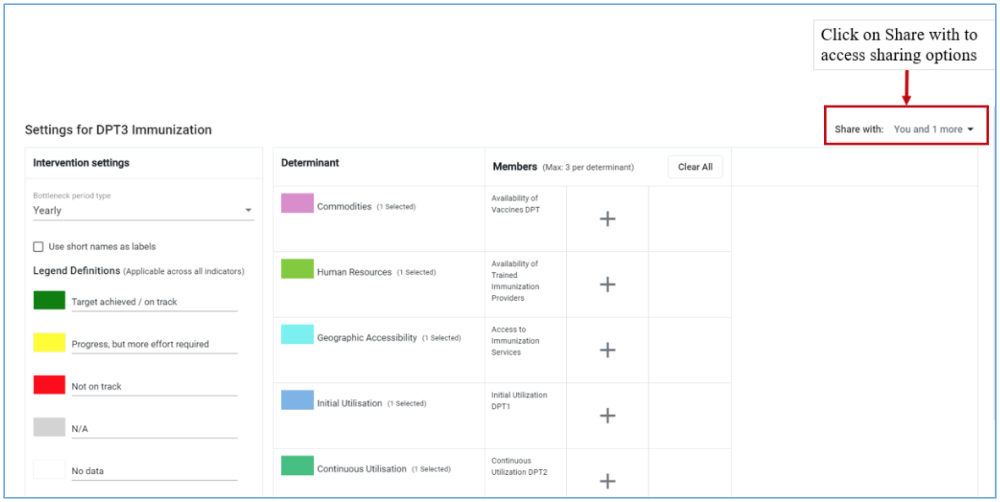

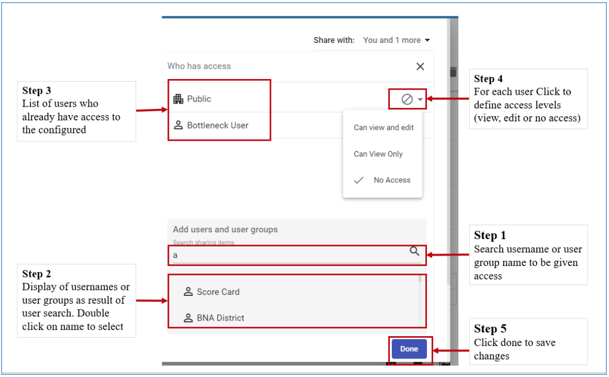

### Deleting interventions configuration

To delete created interventions configuration click on delete icon and follow deletion steps

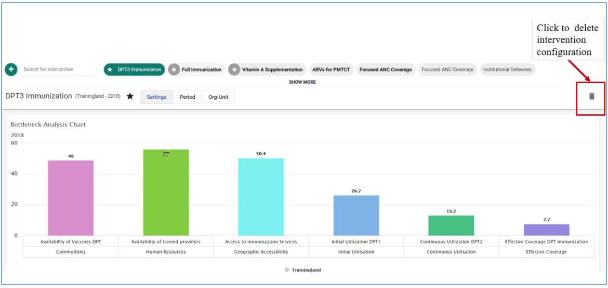

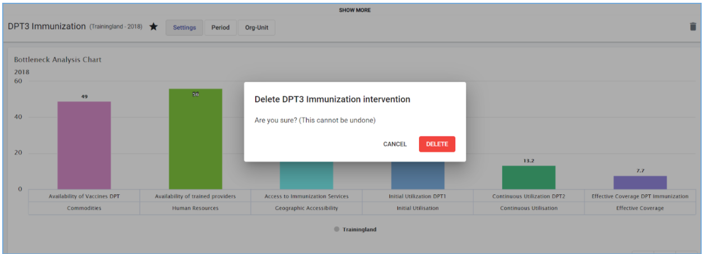
