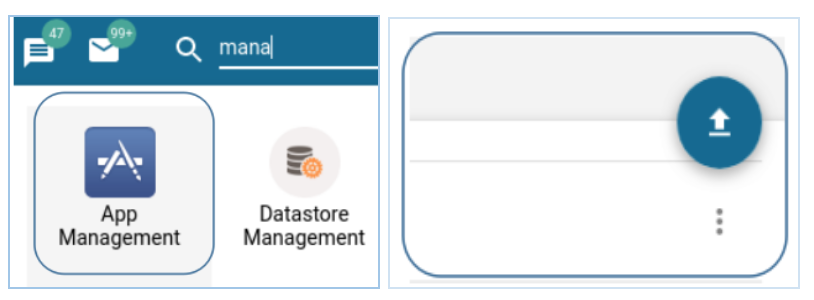
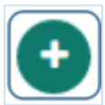
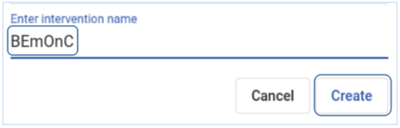
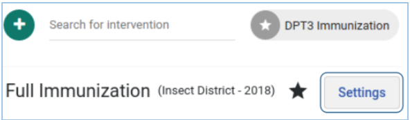
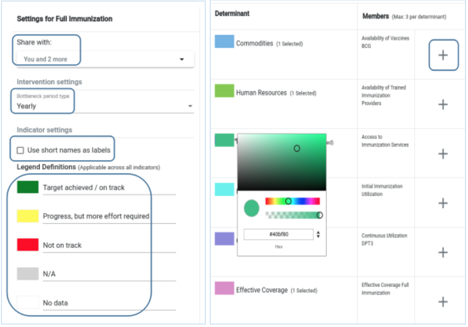
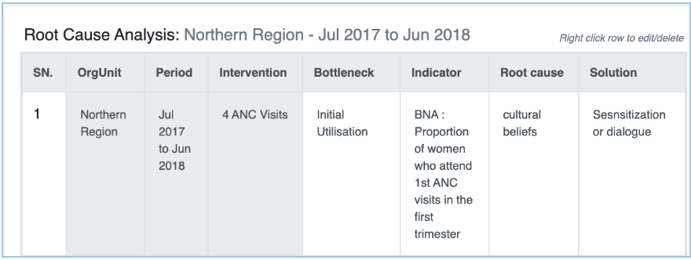
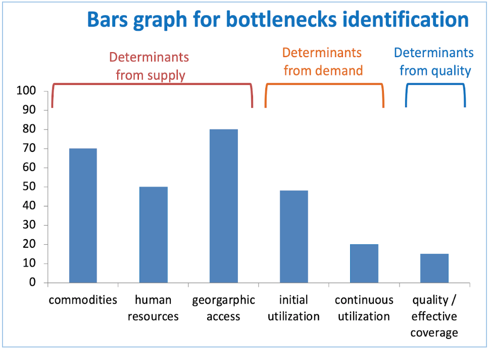
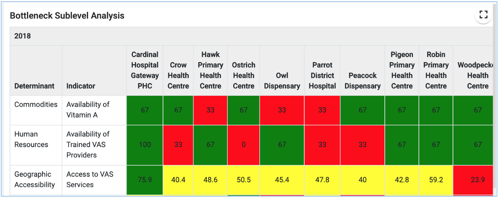

# Setting-up a new BNA App

The BNA App utilizes available metadata and data in the DHIS2 instance. It is
important to ensure that metadata are properly configured prior to installing
the app. The development team has put together pre-configured metadata for
sample indicators found [here](https://drive.google.com/open?id=1HFwRrGrXHWOh7BxMvu0c2_FMXW7TMpzQYQjGCgz58_4). You can download these and use them as an example to setup a local BNA app use case

Best Practices for starting up a new BNA app implementation

The following section describes a list of tips for getting off to a good start
when setting up and implementing the bottleneck analysis app.

1. Identify a real life use case to use in the BNA process.
2. Discuss and identify priority indicators to use in the BNA process.
3. Quickly populate a demo instance, include examples of BNA charts, tables and
 dashboard. Use real data, ideally nationwide, but not necessarily facility-level
 data.
4. Put the demo database online. Server hosting with an external provider can be
 a solution to speed up the process, even if temporary. This makes a great
 collaborative platform and dissemination tool to get buy-in from stakeholders.
5. The next phase is a more elaborate BNA implementation process. Parts of the
demo can be reused if viable.
6. Make sure to have a local team with different skills and background: public
health, data administrator, IT and project management.
7. The core national team should drive the implementation process but be
supported and guided by experienced stakeholders.

## Installing the BNA App

BNA App can be installed into DHIS 2 system in two ways like other DHIS 2
applications.

1. If the application has been uploaded into the play store, users can browse
from DHIS 2 [App store](https://play.dhis2.org/appstore/) to download it.
Installation from App store is simply clicking the application and it will be
installed. Users can refresh the page to see BNA App in the DHIS 2 menu.
2. If the application has not been uploaded into DHIS 2 App store, users can get
 the zipped file and upload into the App manager. App Management access needs to
  be accessed with users who have permission to access and manage Apps. after
  opening App Management, a user is required to click an upward arrow to get
  options to select file for uploading.
  {width=60%}

Best practices for configuration
1. Functionality of bottleneck analysis requires to carefully review meta-data
before setup and configuration. The review should be led and spearheaded by the
core team.
2. Stakeholders are advised to select tracer intervention that will best
represent/identify barriers to health care service delivery.
3. Ensure that all required meta-data (data elements, organisation units,
  datasets and indicators ) are properly configured in the host system.
4. Additional requirements such as data elements for calculating denominators

should be carefully analysed and setup in the host system. In cases where data
is to be imported from other legacy systems, an integration process need to be
in place.
5. Users and their appropriate roles need to be defined first in the DHIS2 and
then in the BNA app for proper management.           

## BNA Access and Navigation

Once installed, BNA App can be initiated by searching it from DHIS 2 menu and
click it  to open. At the first time if no intervention has been configured,
BNA App will load with predefined interventions, with predefined indicators
named “indicator 1” for each determinant. Sub-level analysis and root cause
analysis will be empty. Predefined interventions are replaced with user defined
interventions with configured indicators for each determinant group of every
intervention.

# Data and Metadata

The bottleneck analysis app, works well within existing DHIS2 instance. The app
is well supported in DHIS 2 version 2.28 onwards. The app utilizes existing data
 and metadata in the DHIS2 system to generate BNA charts. BNA app is meant to
 utilize data reported in DHIS 2 system directly or from external systems after
 being integrated or imported into DHIS 2. Data from external systems needs to
 be stored in placeholders created in DHIS 2 for definition of indicators.

## Datasets and Data elements

Data elements are the most critical part of the DHIS 2. For the bottleneck
analysis app to work, it needs indicators generated from data elements within
DHIS 2. Data elements are critical for collection, aggregation and analysis of
Health data. The DHIS 2 support team needs to ensure that most of the data for
BNA app can be generated from the DHIS 2 system.

Some of the data required for the generating BNA charts may be from other sources
that are not pushing data in the DHIS2 for example Human Resource for Health data,
 population data, data from survey report; in such cases, it is important for the
 support team to create data elements / datasets to act as place holders for data
  from external sources. Once the datasets have been created, then data can be
  adequately imported into the DHIS2 system for generating indicators that aid
  the creation of BNA charts. Data elements and data sets are created in DHIS 2
  maintenance App, and can be used for BNA charts and other analysis tools such
  as pivot tables etc. You can learn more on [data element](https://docs.dhis2.org/2.30/en/user/html/dhis2_user_manual_en_full.html#manage_data_element)
  in and [Data set](https://docs.dhis2.org/2.30/en/user/html/dhis2_user_manual_en_full.html#manage_data_set)
  in DHIS 2 Documentation.   

## Indicator mapping and configuration

Indicator mapping and definition are critical for the BNA process to be successful.
Once stakeholders have collaboratively identified interventions and indicators,
best practice is to put indicators for each intervention in the document for
reference purposes. For each indicator, it is important to identify the numerator
 and denominator together with their sources. Mapping document will guide the
 configuration and support team during mapping to know the sources, data element
  place holders for storing data from external systems and other calculations
  methods to use. The mapping document should have details of indicators to be
  collected; numerators, denominators, methods of collection and calculation to
   provide adequate information to the development team.

## Intervention creation

BNA App allows administrative user to create interventions. If no interventions
created, users will only see the default interventions with “indicator 1” labels
 but no data. To create new intervention, user needs to click on the blue plus
 sign button just below list of interventions on the dashboard. Interventions
 are the ones holding determinants which holds indicators.

{width=20%}

Then have to write the intervention name and click create button to save the
intervention.
{width=60%}

**Note**: Administrative users are the ones to create interventions and share
to other users to manage and view.  

## Interventions and Indicators configuration

Interventions, determinants, and indicators must be properly configured for
correct visualization of BNA charts and sub-level analysis. To configure
interventions and indicators, administrative user can click the Settings button
just below the intervention list on the dashboard to get the setup page.

{width=60%}

Clicking the Setting button will present a configuration window for administrative
user to set choose who to share intervention with, set the period for
BNA presentation and analysis, decision to use indicator short names as display
names in the BNA chart, and legends for specified cut-off points for indicator
performance. In BNA, administrative user can change the colour of each
determinant group indicator(s). Bar chart of every indicator attached to a
particular determinant group will inherit the colour of that determinant group.
 To add indicators into determinant group, just click on the plus sign button
 to get list of indicators from indicators or functions to add to the determinant
 group for BNA chart configuration.

###

{width=60%}
**Note**: Ticking “Use short names as labels” option

## Data entry and storage

The BNA app accepts entry of data for the root cause analysis component.
The main fields captured include the possible root cause and solutions for the
gaps in implementation of an intervention.

{width=60%}

The entry of root causes and solutions should follow a comprehensive process of
 causality analysis usually done during the District Health Management Team
 meetings. The “ADD” button on the root cause analysis component will facilitate
  entry and allow you to add as many causes and solutions as possible.

**Note**: These records will also be useful during the planning cycle where
district teams will formulate action plans and a monitoring framework for them.  

Configuration data for indicators and data from root causes analysis are stored
in the DHIS2 “Data store”. The data store is resident on the server hosting the
DHIS2 instance and can be modified using the DHIS2 data store management app.
Data contained in indicators are saved in DHIS 2 database.

**Note**: i. When the BNA App is uninstalled from the DHIS2, the data stored
remains, unless  if the data stored is removed.

ii.  Access to the BNA datastore is limited to system administrators only

## Data analysis and presentation

Data analysis and presentation on the BNA app is based on the Tanahashi Model
for health systems strengthening and strategic planning. The model emphasises
6 determinants of coverage (Availability of Commodities, Availability of Human
  Resources, Access to health facilities, Initial utilization of health services,
  Continuous utilization and Effective Coverage.)

Data visualization is interactive with dynamic relative periods and organisation
units. BNA charts will also be automatically generated once DHIS2 data has been
updated.

{width=60%}

**Note**: The golden rule for analyzing BNA charts is  “The demand side cannot
be higher than the lowest bar in the supply side” where the denominator is the
same. Additional guidance [here](https://www.who.int/bulletin/volumes/93/6/14-141879/en/)

Data on the BNA chart is further displayed in a sub-national level tables to
show performance of facilities using a scorecard colors (Red, Amber & Green).

{width=60%}

Data entered in the BNA app using the root cause analysis feature can be analyzed
based on the organisation unit, and period of analysis.

**Note**: all the data presentation charts, tables and reports can be downloaded
to either Excel, PDF or Word.

## Rollout and Implementation strategies

1. The rollout team should give thought to scale-up of the bottleneck app,
following  a successful user acceptance testing phase. The rollout should consider
 sustainability efforts including support within the MoH structure.
2. The core team should play a key role here and each member should have clear
responsibilities for the roll-out covering: user support, user training, liaison
with health programs, etc.
3. Broader support structures need to be established to provide support,
supervision, and communication with global/regional network of expert users and
 developers.
4. Information use must be a focus area from the start and be a component both
in the initial system design and the first round of user training.
5. District Health Team (DHT) review meetings and or equivalent should be
supported with appropriate BNA information packages and training.
6. Training will typically be the largest investment over time, and necessitates
 structures for continuous opportunities. Plan for a long term training approach
  catering for a continuous process of enabling new users and existing users on
  new system functionalities.
