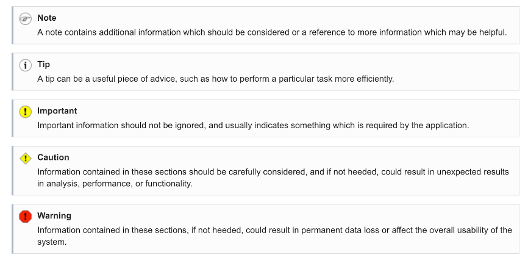

# About this guide

The BNA User Guide documentation is a collective effort and has been developed by the development and administrative teams of HISP Tanzania, HISP Uganda, and University of Oslo with Support from UNICEF. BNA is an App running on DHIS 2 platform, aimed to be installed into National HIS. While the guide strives to be complete, there may be certain new functionalities which have been omitted or which have yet to be documented. This section explains some of the conventions which are used throughout the document. In many cases, screenshots have been included for enhanced clarity.

Different styles of text have been used to highlight important parts of the text or particular types of text, such as source code. Each of the conventions used in the document are explained below.

## Intended Audience

This guide is intended to be used by users who have been given the mandate to set up a national bottleneck analysis from the selected set of indicators for given interventions and sharing of objects related to BNA application
