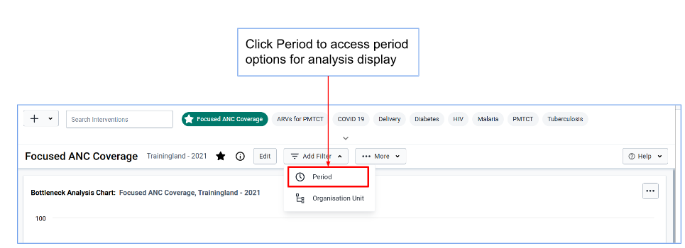

## 3.2 BNA Analysis and Interpretation

Once the configuration is done by Administrator,users have an option to access interventions configured and shared with them for viewing analysis charts.For each intervention shared to the users, users will be able to further select periods and organization units (locations) for which they want to view bottleneck analysis for.

Note: Users can only access interventions shared with them by the administrator(s) who configured the intervention

Accessing intervention for analysis

Search for Bottleneck Analysis application and click on it

Upon loading the BNA App, users will have access to available interventions and an option to search for more interventions.Accessing the shared interventions is limited to the access level they are shared.

Selecting period for analysis

After selecting intervention to analyze, the user can specify which period s/he wants to view analysis for.To be able to access and change period, click on Add Filter then period tab.

Organization units selection

The BNA App allows the user to make organization unit selections based on groups,levels and user organization units,these are known as selection modes.

Note: After completing selection of organization units,user must click on Update button to save changes

Downloading bottleneck analysis chart

To download the displayed bottleneck analysis chart, users can choose from the three dots on the right side of the chart with options to download as PDF,Excel and PNG.

Bottleneck analysis Interpretation

Bottleneck analysis is a systematic way to look at the main determinants of effective coverage for selected interventions to identify problem areas to purposely act on them.The Six coverage determinants,from supply to demand side,prove a mechanism to analyze where health system bottlenecks exist. A bottleneck is a loss of system efficiency. (Adapted from Tanahashi model)

Each intervention in the bottleneck analysis application comes with three intervention items,the bottleneck analysis chart,sublevel analysis table and root cause analysis widget which are there to assist the district user in analyzing the bottlenecks and enter the route causes and solutions for each identified bottleneck.

Bottleneck chart operations

The bottleneck analysis chart is a bar graph of the bottleneck indicators sub-divided in groups of their determinants.The bottleneck analysis chart can be configured through the global filters whereas the national level administrators can make data selections and sort the arrangement of determinants, determinant group color, organization unit and period filters for other national users who are not administrators, regional and district users to make changes on organization unit and period filters.

Analyzing bottleneck Charts

1. Start from left to right: supply first, then demand, then quality

2)Identify the lowest bar in the supply side (weakest determinant in the existing system)

3)Identify the biggest drop in the demand side and quality

A bottleneck is a significant gap or drop in coverage determinant between the expected and the observed.Services must be available first before they are used. Therefore, bottlenecks are analyzed starting with supply,followed by demand and finally by quality.The cascade rule means that quality can not be higher than demand and demand higher than supply.

To highlight bottlenecks in the charts, simply click on the bar that represents the identified bottleneck.The bar should change to color RED.This color is not saved as part of the values that represent the difference performances.

When the graph seems different from what we expect, care should be given to assess common factors e.g using different denominators for supply,demand and quality.

Sublevel Analysis

The sublevel analysis table makes use of the global filters that the bottleneck analysis chart makes use of with an additional operation of legend configurations for each indicator that has been selected.It presents sublevel analysis of performance of each of the indicators in determinant groups for selected intervention.

In the sublevel analysis table, users can switch the layout of the table to between determinant rows and org unit rows presentations.To achieve this one can use the two buttons at the top right of the table.

Indicator Dictionary View

The BNA app is equipped with an indicator dictionary to provide additional information on the indicators used in the definition and creation of BNA chart.To access the indicator dictionary, click on the Dictionary View in the sub-level analysis table.

The indicator dictionary will display the list of indicators used in creating the BNA chart, including numerators and denominators, calculation details and corresponding data elements.
