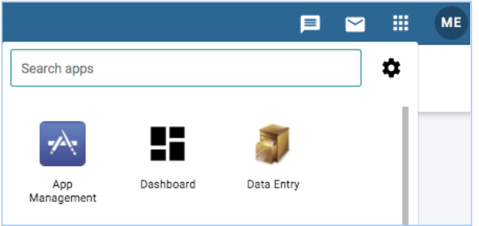
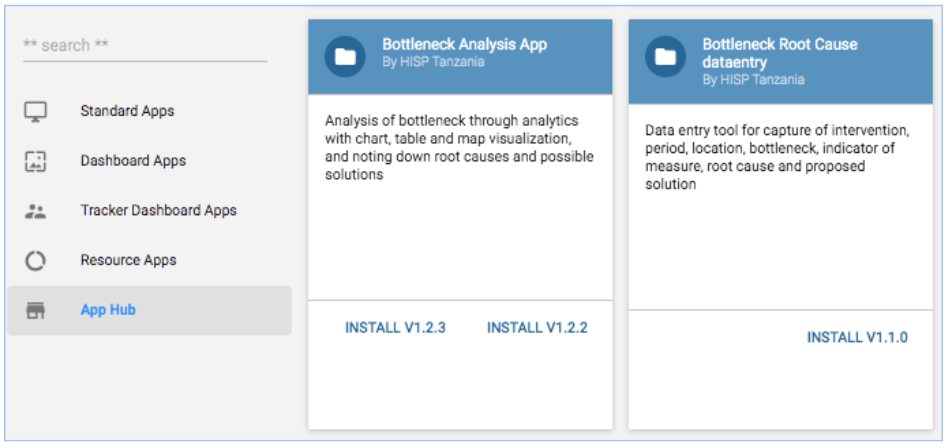
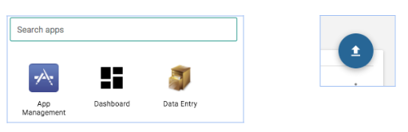
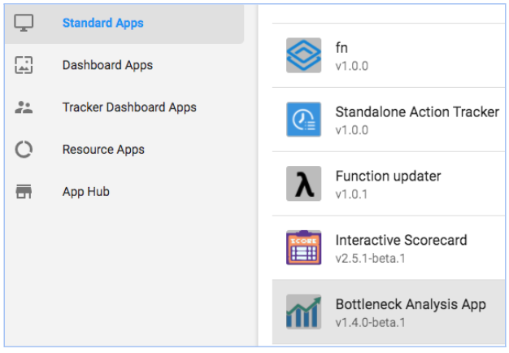

# Chapter 2. Bottleneck Analysis App Administrators’ guide

## 2.1 BNA App installation and Configuration

Administrative users can install BNA App from DHIS 2 App store, or by downloading the zipped file in the DHIS 2 App Management if the App is not uploaded into DHIS 2 App store. To install an application in DHIS2, you require superuser privilege.

    If the application has been uploaded into the play store, users can browse from DHIS 2 App store to download it. Installation from the App store is simply clicking the application and it will be installed. Users can refresh the page to see BNA App in the DHIS 2 menu.

    Step 1:  Access app management from the apps selection menu

    Step 2: Once Apps management is open:

    	i).Go to the apps store panel and a list of online applications for installation will show up.

Note: Unlike the previous versions of the bottleneck analysis application that demanded installation of the application and the bottleneck root cause analysis application separately, the current version installation of the app incorporates the root cause analysis widget too.

    	ii)Users can get the zipped file and upload it into the App manager if the application has not been uploaded into the DHIS2 App store already.

    	iii)App management can only be accessed by users with the right permissions and roles to access and manage apps. When the management app opens, a user is able to select a file to upload. The user should continue to select the upload icon (upward arrow) which displays a window that prompts the user to select the zipped file to upload, then click “open” to upload

Once the bottleneck analysis application has been installed, it will be enlisted under standard apps.

Note: The zip file name may have a cryptic alphanumeric name such as “727a1631-85e4-4313-be1f-b5f02f7e25e2”. You may want to rename the zip file to easily locate it in the future with naming such as “Bottleneck App v1.4.0-beta 1” or “BNA App v1.4.0-Beta 1”.

When done installing, the bottleneck app will be accessible from the search menu. If the bottleneck analysis app does not appear on your menu, it could be a result of the following two issues.

    i)Installation Access credentials/Permissions

While the bottleneck analysis application may be installed within your DHIS2 instances, you may not have the necessary permissions to view it. In these cases, communicate with your DHIS2 administrator or DHIS2 support team for the application to be assigned to one of your user roles.

    ii)Installation not successful

The bottleneck analysis application will not be visible in your application if it has not been installed successfully.
