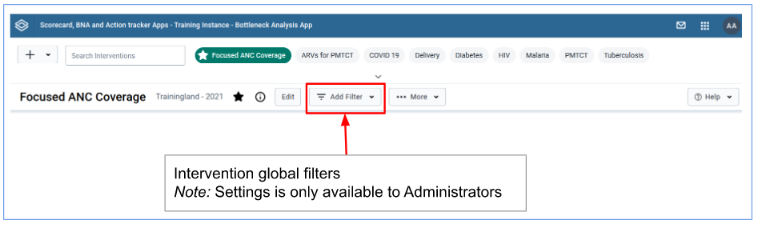

# Chapter 3. Bottleneck Analysis App User guide

## 3.1 BNA App Layout

The BNA Application is built on architecture that eases the user interactions by having a design concept that promotes the user to follow their intuition complemented with high performance that considers the lowest internet connection scenarios with descriptive notification messages if the user misses a step along the way.

BNA App Design concepts → Do more with less steps

Most of the operations in the application can be achieved in three steps or less.The BNA App gives a district user or any user at any level with no administrative privilege the ability to perform operations without a need to switch between modules or drop ongoing activities.Users can bookmark interventions, filter interventions by organization unit or period and more with everything being just a click away.

Interventions list

Upon loading the BNA App, users will have access to available interventions and an option to search for more interventions.Accessing the shared interventions is limited to the access level they are shared.

Interventions Global filters

Right under the interventions list there is a filter control for the active intervention.The filter control when clicked expands to offer the user an ability to select a new period and/or organization unit.The applied filters will affect the entire BNA dashboard and the changes will only be visible for that particular user at that particular time.

Intervention items

    1)The Bottleneck Analysis Chart
    2)The Sublevel Analysis Table
    3)The Root Cause Analysis Widget
