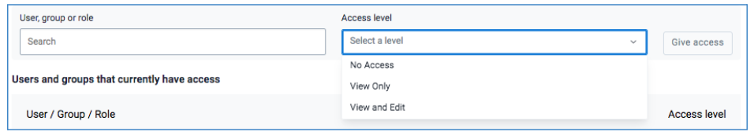
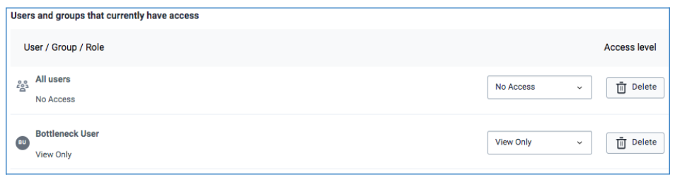
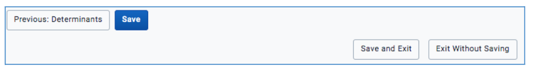

## 2.4 Grant Access to users

Administrative users need to share interventions for other users to access by granting either view only, view and edit or deny access to the specific intervention.

A user or a user group can be granted one of the following access:

    i)Can View and edit: Any user having access with this privilege, is granted access to and can modify or make changes to any shared intervention’s details, including changing settings of items in it. This access should only be given to administrative users only.

    ii)Can view only: Administrative users should select this option to share the intervention with users who are supposed to access BNA chart and sub-level analysis and enter root causes. For BNA application context, view only is granted to users at any level in the organization unit hierarchy who are not supposed to make any changes to the settings.

    iii)No Access: Users with this access level option may have access to the BNA app but do not have access to the created intervention.

## 2.5 Saving Configurations

After the administrator is satisfied with the filters that they have applied for an intervention, they should save them for the interventions.

The administrative user should select the “Save” button; highlighted in blue color, to save the configurations for users to perform analysis.

After saving, the user is able to view the Bottleneck Analysis chart, Bottleneck Sub-level Analysis and the root cause Analysis based on the created intervention.

However, the user may also opt to save and exit by selecting the Save and Exit button or to select the Exit Without Saving button to cancel the work done so far and exit or start afresh.

Note: Editing and saving configurations of a shared intervention will reflect the new configurations to respective users with whom the intervention has been shared with.
