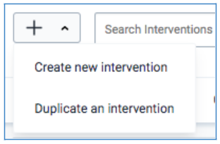
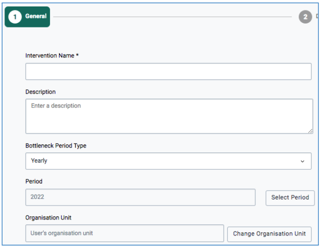
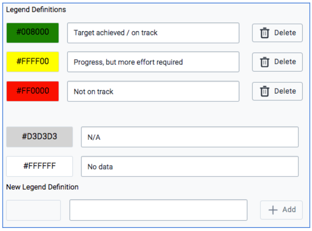
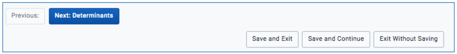
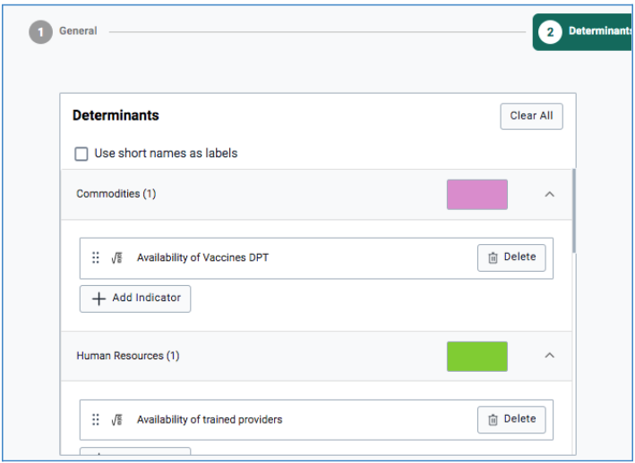
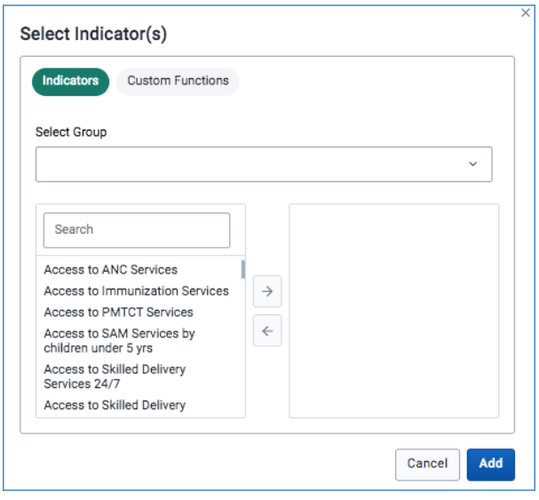
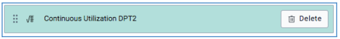
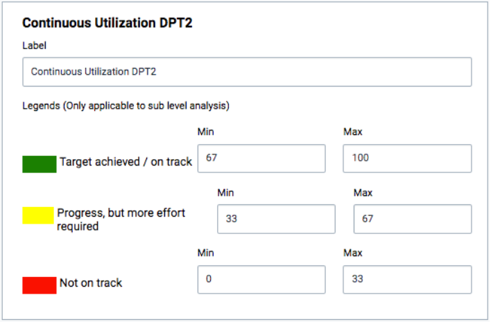

## 2.2 Interventions and Indicators Configuration

If no Intervention created and assigned to the dashboard, BNA App loads with predefined interventions, with predefined indicators named “indicator 1” for each determinant. Sub-level analysis and root cause analysis will be empty.
Administrative users can create interventions and assign them to the dashboard for other users to access depending on the sharing access granted to them.

### 2.2.1 Creating Intervention or Duplicating Intervention

Interventions are the ones holding determinants where indicators are assigned. Each intervention consists of bar charts that can help users at any selected level to analyze and identify the bottleneck. The bottleneck analysis application supports creating new intervention from the scratch or through duplicating the existing intervention:

i)A user with administrative privilege can create a new intervention by clicking on the plus sign button just below the list of interventions on the dashboard.

ii)A user with administrative privilege can duplicate the existing intervention by selecting the “Duplicate an intervention” option that pops up on clicking the plus sign, then rename the intervention with another name. A duplicate intervention has an advantage of using the same indicators assigned, only that the user can replace the indicators to fit the intervention under creation.

Note: Interventions are the ones holding determinants which hold indicators.

Then have to write the intervention name (eg. Focused ANC Duplicate), select the period type, organization unit level to set up the intervention name and period.

Then select legend colors for each legend that will be displayed in the sub-level analysis to indicate the performance of each indicator for each selected level. It is important for the administrative user to set a ‘user organization unit’ as the default period so that every user can have a BNA chart for their levels displayed. It is good practice to assign user organization unit so that every user can access BNA chart and sub-level analysis relevant to their levels

After setting the intervention name, period, organization unit and legend colors, the administrative user needs to click the “Next: Determinants” tab to get into determinants and assign indicators.

The user may also opt to save and exit by selecting the Save and Exit button or Save and Continue button to save the details so far and add more in the next section. The user may also opt to select the Exit Without Saving button to cancel the work done so far and exit or start afresh.

### 2.2.2 Interventions and Indicators configuration

To configure intervention to assign indicator(s) and color for each intervention, an administrative user can click the “Next: Determinants” button to get there and click against each intervention to add an indicator.

To add indicators into a determinant group, the user should select the ‘+Add indicators’ button which will prompt the user to choose from the list of indicators or functions to add to the determinant group for BNA chart configuration.

To set up cut-off points for each indicator, administrative users should click the indicator name against determinants which will display the color from white to confirm selection.

This prompts the display of a window to the right side of the determinant’s section to enable the user to enter cut-off points.

