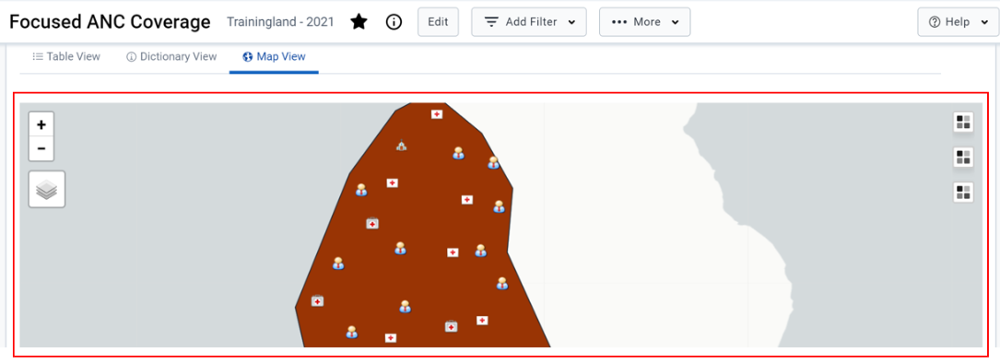

Map View

The BNA app provides an option for viewing analytical outputs in a map. This allows viewing different indicator performance as per map layers configured in the app. To access the map view option user can select the “Map View” tab

The map view option has the following section:

1. Map display area: This is the general display area where the map output is displayed. It provides the option to zoom in and out to adjust the map display.

2. Layers selector: This is a configuration feature that allows the user to select what layers (components) should be part of the map output. Users can select to display boundaries, facilities, population or specific indicators configured for the BNA chart analyzed

3)Map key: This provides details of the symbols, color codes, and ranges for the output displayed. For the indicators, the map key will be displayed depending on the number of indicators selected.

Root Cause analysis

After the district user has looked at the Bottleneck Analysis Chart and the Sublevel Analysis Chart and has identified the major bottlenecks, they are expected to proceed to Root Cause Analysis Widget.In the root cause analysis widget they can document the Root causes and Solutions of determinants and indicators for the active intervention based on the period and organization unit filters applied.

At first glance the widget will come up empty and the user can create a new empty row by simply clicking the “Add New” button.A pop up form will show up where a user will be required to select the bottleneck and Indicator from a dropdown list and use free text to document the possible root cause and possible solution.Once done there is a save button in the bottom right of the pop up form to save the details.

Note: Bottleneck field will allow user to select the determinant for the root cause and once the determinant is selected, the related indicators of that determinant for the BNA chart will be displayed for selection

The quality of the causality analysis is a critical determinant of the quality of the resulting plans and the impact on health system performance.It is important to have around the table people with the right knowledge and expertise.

Once a bottleneck is identified,the root causes need to be thoroughly assessed

It is important to know what to look for when facilitating a root cause analysis.

1. Common causes of bottlenecks in the health system (specific for each determinant)

2. Main environmental factors (Social Norms,Legislation/Policy, Budget/expenditure,Management/Coordination)

3. Possible crisis/hazards (if relevant)

Once identified, proposed solutions/ actions need to be documented for follow-up and implementation.

To edit data the user can simply double click a row to make it active for editing or right click a row to get a context menu.Currently the context menu has two operations Edit
