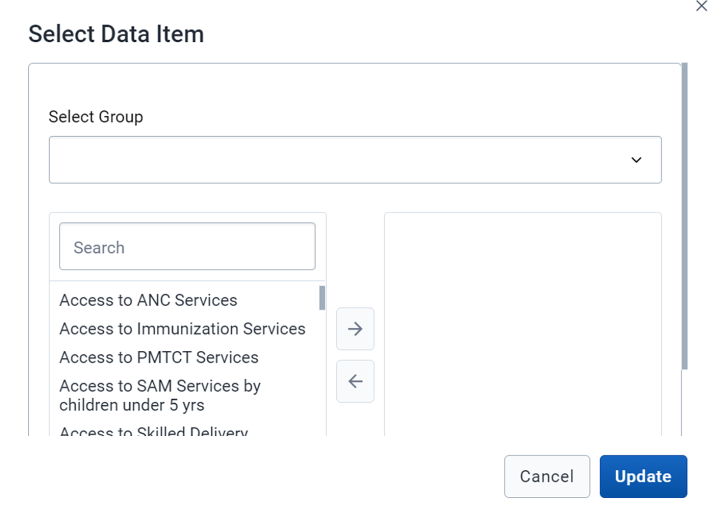

### 2.2.3 Map configuration

This allows the user to configure options for the map analysis feature for the BNA charts that have relevant information for map analysis

Note: User can decide to include or not include the map analysis option for different BNA charts

Configuration of the map feature allow users to setup the following options:

    1.Thematic layer: this option is automatically available once the user has enabled the map analysis feature for the BNA intervention configured.

Note: Configuration of the thematic layers allows selecting the following options

    1.Layer type: this provides two options:

        a)Choropleth: A map layer that uses difference in colors or shading to represent data.

        b)Bubble: A map layer that uses circular figures (bubbles) to represent data. The data is represented by the size of the bubble and the color

    2.Boundary layer: User has the option to enable or disable the default display of the boundary layer. Enabling the boundary layer will ensure the boundary layer is visible on the map by default. The view can be toggled by the layer control on the map at any time.

    3.Facility layer: User has the option to enable or disable the default display of the facility layer. Enabling the facility layer will enable the facility layer to be visible by default.

    The icon settings allow the user to select which icons should represent the facilities within the map. The custom icon selection allows the user to select one icon which will represent all facilities on the map. Group set icons allow the user to select a pre-configured organization unit group set from DHIS2 configuration which groups the organization units (facilities) and assigns an icon to them.

    4.Earth engine layer: User has the ability to select and configure layers from Google Earth Engine. Supported layers include population, land cover,  and building footprints.

Note: Configuration of the Earth engine layer allows selection of the following layer types:

    1.Population: Estimated number of people living in an area according to the WorldPop/ Google Earth Engine dataset. (https://developers.google.com/earth-engine/datasets/catalog/WorldPop_GP_100m_pop)

    2.Building footprint: The outlines of buildings derived from high-resolution satellite imagery. Only for the continent of Africa from NASA/USGS/JPL- Caltech/ Google Earth Engine  (https://sites.research.google/open-buildings/)

    3.Landcover: Distinct land cover types collected from satellites from NASA LP DAAC/Google Earth Engine (https://developers.google.com/earth-engine/datasets/catalog/MODIS_006_MCD12Q1

Upon selecting the layer type, user will be able to do further configuration for the layer which include aggregations types and period,

