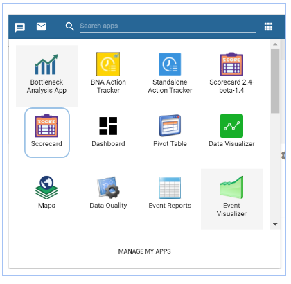
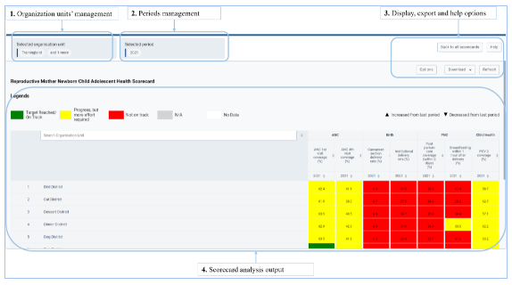
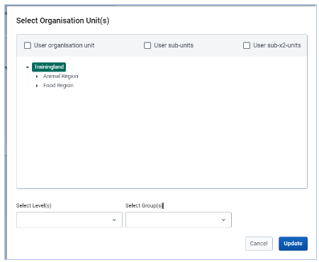
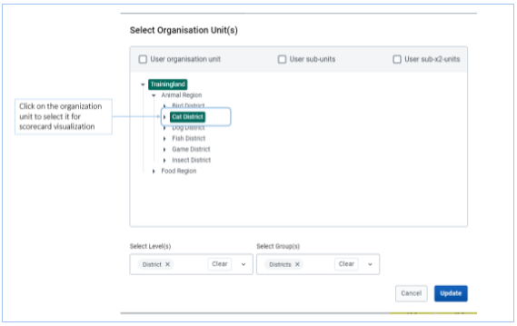
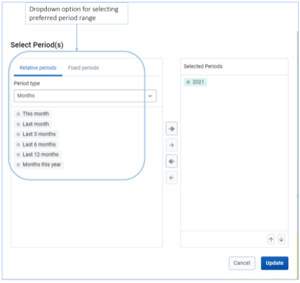
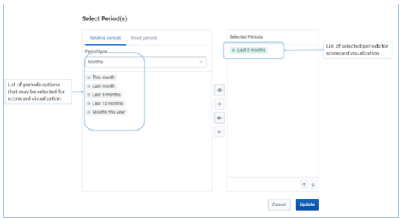
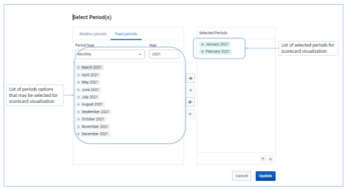
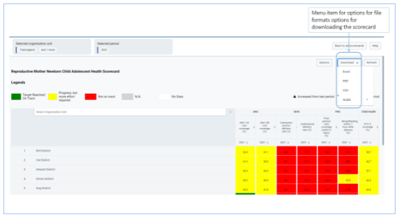
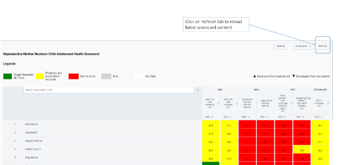
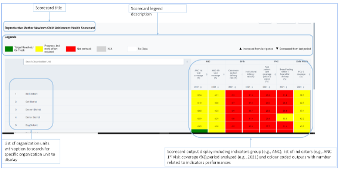

# Accessing and translating the Scorecard

The Scorecard App can be found in the Apps menu. if the application has not yet been installed in your DHIS2 instance or installation has issues, refer to the installation instructions of the implementation guide for further guidance, or contact the DHIS2 administrator for assistance.

## Selecting the scorecard

To select the scorecard you want to visualize click on the View option as shown in Figure 10 below. If you do not see the scorecard you want to visualize, please refer to section 2.4.2 on how to search for a scorecard.

Upon clicking the View option, you will be taken to the main page of the scorecard you have selected. The scorecard’s main page will include the following options:

**_Organization units’ management:_** This section will provide you options for selection location (organization units) for which you want to visualize the scorecard for

**_Periods management:_** This section will provide you options for periods for which you want the scorecard analysis to be done for
Display, export and help options: This section will provide options for managing how the scorecard analysis outputs should be displayed as well as options for exporting and/or printing the scorecard outputs. The help option provides a built-in navigation guide on how to use different menu options of the scorecard app.

**_Scorecard analysis output8_**: This section will output the analysis results for all the selected organization units and indicators or indicators groups for the scorecard. The output section is preceded by the colour-coded key that explains how each scorecard should be interpreted.

## Organization units’ management

This section will allow you to select the organization unit on which you want the scorecard analysis to be done. You will be able to choose three options for selecting organization units for scorecard display; first selection by organization unit (selecting a specific location to view scorecard for), second selection by level (selecting organization unit level e.g., region or district to view scorecard for) and third selection by Organization unit group (selecting groups of organization units e.g., hospitals to view the scorecard for)

After selecting the category of organization unit to view, you will be able to select the specific sub-option to select. For the first option selection by organization unit, you will be able to select a sub-unit to view, for the second option of selection by level, you will be able to select the specific level to view, and for the third option of selection group, you will be able to select specific organization unit to view

To select a specific organization unit after selection options outlined in figure 12 and 13 above, you may click on a specific organization unit’s name to select the organization unit for visualizing the scorecard for.

After selecting Organization units’ option to view, click Update to confirm the selection and alter the scorecard display to match the selected organization unit you have chosen.

## Periods management

The period management section allows you to select specific periods or periods for which you want to visualize the dashboard for. To get options for selecting periods, click on the period selection tab (Figure 15)

You can select a period using the Relative Periods or Fixed Periods options. Period option will be listed on the left hand side. To select the period of choice, double click the period. Once selected (double clicked) the period will be shifted to the right hand (Figures below). To deselect the period (from the right hand side) double click it.

## Display and export options

This display management section allows you to select display options determining how the scorecard output should be displayed.

The scorecard display options allow you to management the following:

**_Legend:_**choosing if legends should be shown or not
**_Title:_** choosing if the scorecard title should be displayed or not
**_Item number:_**choosing if listing of organization units should include item numbers
**_Empty rows:_**choosing if scorecard outputs with zero values should be displayed or not
**_Show hierarchy:_**Option for displaying organization units hierarchy when displaying scorecard outputs
**_Average column:_**choosing if the average column should be displayed or not
**_Average row:_**choosing if the average row should be displayed or not
**_Highlighted indicators:_** Option for displaying indicators that were added as indicators of interest to tracked.
**_Average:_**allowing you to choose to display all organization units or those that have performed below or above average only.
**_Options:_**choosing if you want to display arrows showing changes (increase or decrease in performance) and actual performance data (number) related to colour coded outputs of indicators to be displayed

The display and export section also include an option for downloading the scorecard. Click on the Download icon to get options of allowable file formats for download. Click on the preferred file format then save the file to be downloaded to your preferred location (as per your browser settings). The scorecard can be downloaded as Excel, PDF, CSV or ALMA options (JSON or CSV Metadata)

For each display this section also allows you to refresh the scorecard and get the latest analytical outputs. This could be relevant in case there are ongoing changes as you are viewing the scorecard or there is a need to clear the cached display.

## Scorecard analysis outputs

This section is used for displaying the scorecard outputs based on options selected as guided in sections 3.1.1, 3.1.2 and 3.1.3.

The scorecard analysis output section has the following main sections

*Title:*displaying title of the scorecard
*Legend description:*describing colour codes used and marks for increase or decrease in performance
*Organization units list:*Displaying list of organization units analyzed with option to search for specific organization unit to display
*Scorecard output:*with information about indicators group (if added), indicators names, period analyzed and colour coded outputs of the analysis with corresponding performance.
