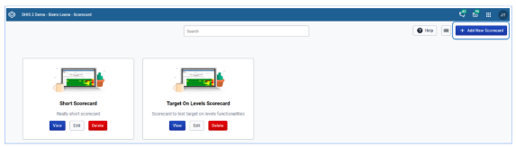
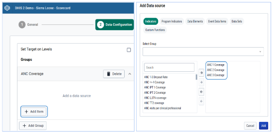
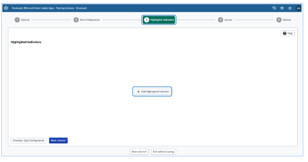
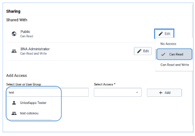
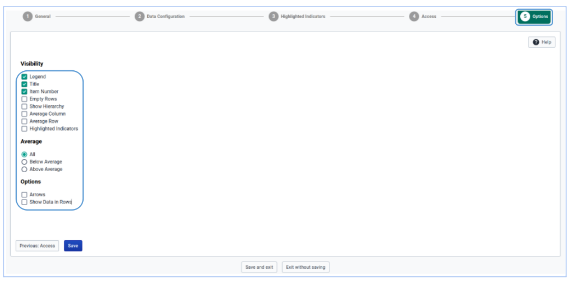

## Creating the Scorecard

A user has to click on the scorecard application to get the list of created scorecards, or have access to create the new one. To create a new scorecard, a user has to click on the Add New Scorecard button at the top right corner of the screen.

### Filling up the general information of the scorecard

A user should click on the scorecard application to open it and have access to configure. Then fill in the information in the respective fields as per field label against each field under General tab.

### Legend definition

To set up legend definitions, a user has to scroll up the page and change the color codes and associate the legend definitions by clicking on the color selectors available. To add more legend definitions, a user needs to click on the ‘Add item’ button below the legend definitions. For deleting the legend, a user needs to use the Delete button next to each legend.

### Creating group for related indicators in the scorecard

To select indicator groups, indicators, and cut-off points for poor, average and good performance a user has to navigate to the ‘Data configuration’ tab. The user is supposed to click on the Add group to be able to add items for scorecard configuration. At the right hand side, there is information that guides on items to be done to get the scorecard generated.

To edit the default group created after clicking the Add group button, the user has to click on the edit icon against the default group name (Group 1), and write the appropriate name of the group and save.

### Adding indicators to the group

Then the user can add indicators by clicking on the Add item button and selecting indicators from the list and moving to the right hand side, click ‘Add button’ to add them to the scorecard.

Note: The process of adding indicator groups and indicators in a group can be repeated as in the Figure 8 until all groups and their indicators are exhausted.

After saving the selected indicators, the layout of indicators and cut-off points for each selected indicator, the number for effective gap, and options to display arrows for effective gap, and show colors are made accessible for administrative users to apply.

### Configuration of Indicators whose performance is good by decreasing the value

For indicators whose good performance is when the percentage is decreasing in number, the indicator can be simply configured by unchecking the ‘High is Good’ option that appears just on top indicator cut-off points.

### Paring related indicators

For the case of pairing of related indicators, it can be easily done by clicking the hyperlink next to the right of the indicators. This is helpful to save the horizontal space of the scorecard layout and place related indicators in one column for comparison purposes.

### Selecting Highlighted indicators

To select indicators for indicators that should be highlighted while displaying the scorecard, a user has to navigate to the ‘Highlighted Indicators’ button and add. With highlighted indicators, a user can quickly have a look at the performance of such indicators just on top of the generated scorecard.

### Sharing Access

The scorecard should be shared to individual users or user groups for them to get access to. This is a very important concept in DHIS2 that every object cannot be accessed by anyone apart from the one created unless it is either given a public access sharing, or shared with users or a group of users. Scorecard sharing can be extended to decide to share the access to which level. For example, a program can have a district scorecard configured and only shared to the level of the district, as well as user groups. For the scorecard under configuration, a read access for the test user has been assigned to allow a user with a test account to only browse the scorecard without changing anything.

### Setting the options

To select a list of options to be displayed by default when any user loads the scorecard before making his/her own selection of options, the user can configure the scorecard by selecting the options button at the right corner of the displayed window. The selected options persist even when the normal user makes his/her own selections and later decide to reload the scorecard.

