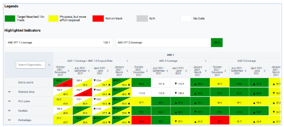

## Saving configuration and load the scorecard

The user needs to save the configurations made and load the scorecard to visualize it as other normal users will do (Figure 15). This finalizes the scorecard configuration and saves it to the system for access with users with shared access.

