#  App Administration
The Standalone Action Tracker App includes a module for administrators to configure key metadata for the normal user. The administration configurable options include:

1. **_General settings:_** management of planning period, tracking period and planning organization unit level.
2. **_Challenge identification methods:_** management of allowable methods that users may select as methods used to identify challenges for the plans and actions to be documented.
3. **_Action status option:_** management of possible status options for actions to be documented and tracked.

## 4.1 Accessing Administration module

To access the standalone action tracker administration module, click on the Settings button.
**Note:** Only users whose accounts have administrative privileges can access the administration module

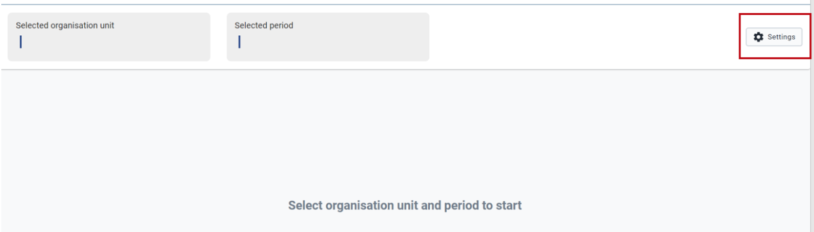

**4.2 Managing general settings**

The genera settings allow users to manage the following three options:

1. **_Tracking period:_** This is the period that users will be allowed to register actions for and track status of their execution. For defined organization unit level, users will only be able to select periods as per the predefined period type selected here.
2. **_Planning period:_** This is the period that users will be allowed to register plans for each organization unit. For defined organization unit level, users will only be able to select the planning period as the predefined period type selected here.
3. **_Planning organization unit:_** This is the allowable planning level at which users will be allowed to register plans to be tracked. If for the given DHIS2 instance usage, planning is done at council level, then the user should select council level during this configuration.

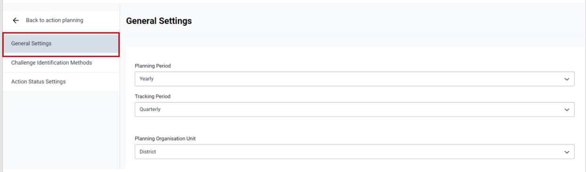

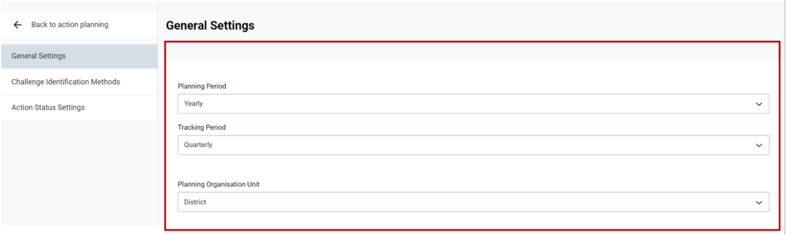

## 4.3 Managing challenges identification methods 

This option allows administrative users to define methods that can be associated with documentation of the challenges for the interventions to be tracked. When documenting interventions and actions, normal users will be required to select what method was used to identify the challenge to be tracked. This administration module allows definition of such methods.

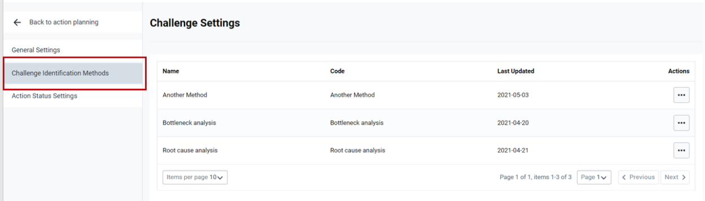

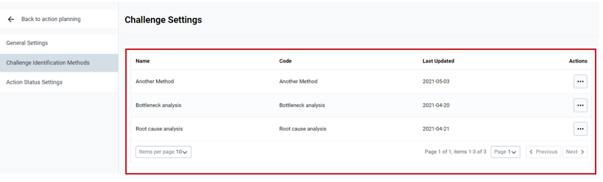

**_Note:_** If the administrator will be accessing this section for the first time, he/she will be notified that there are no methods registered.

### 4.3.1 Adding new method

To add a new method, the administrator should click on the plus button and complete the required information on the new form for adding the method. Upon completion of adding required information, the user should click on the Save Method button.

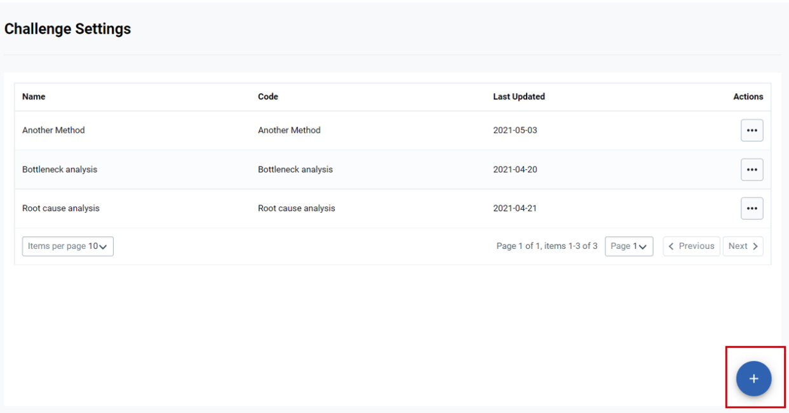

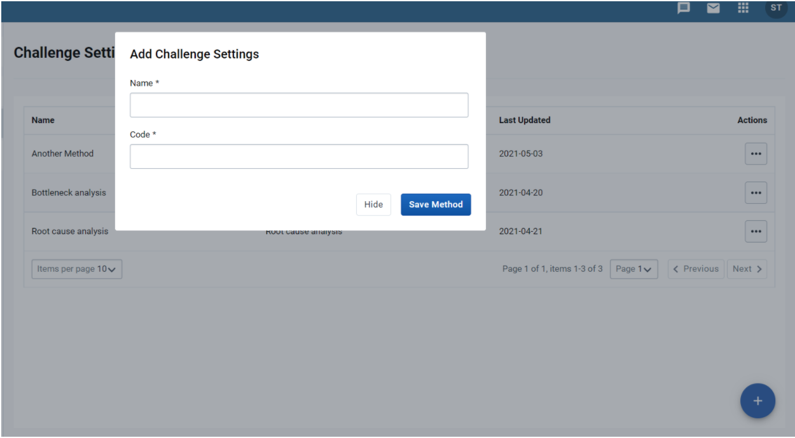

### 4.3.2 Managing existing method

On the list of registered methods, administrators may click on the actions option to be able to delete or edit details of the existing method.

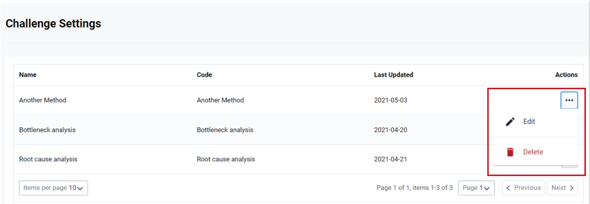

To edit details of existing methods, users should click on the Edit option and update the method details. Upon completion of updating the method details, the user should click on the Save Method button to save changes.

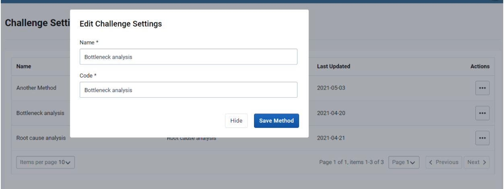

To delete the details of the existing method, the user should click the non Delete option. To delete the method, the user should click on Delete button on the deletion confirmation pop-up form.

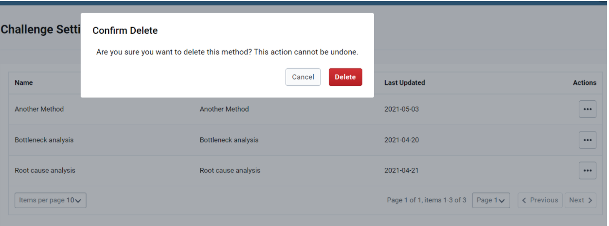

## 4.4 Managing status options

This option allows administrative user to define possible status methods that normal user can assign to actions to be tracked. To allow for easy visualization, definition of status allows administrators to link them with colour codes that can easily indicate if the progress is good or bad.

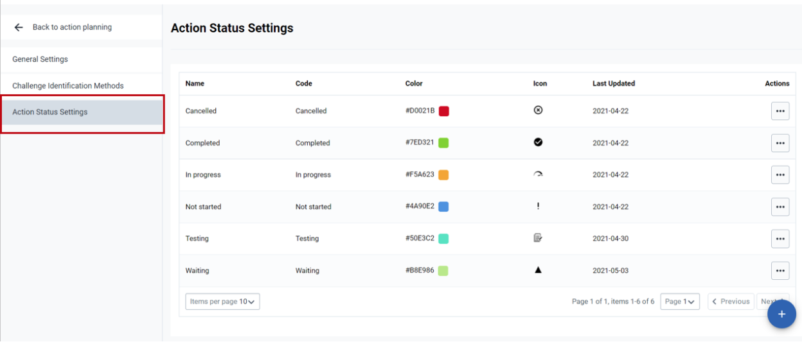

Note: if there will be no action status added, administrator will be notified that there is no existing methods.

### 4.4.1 Adding new action status

To add new action status option, administrator should click on the plus (add) button and complete details and configuration the action status as per form to be displayed

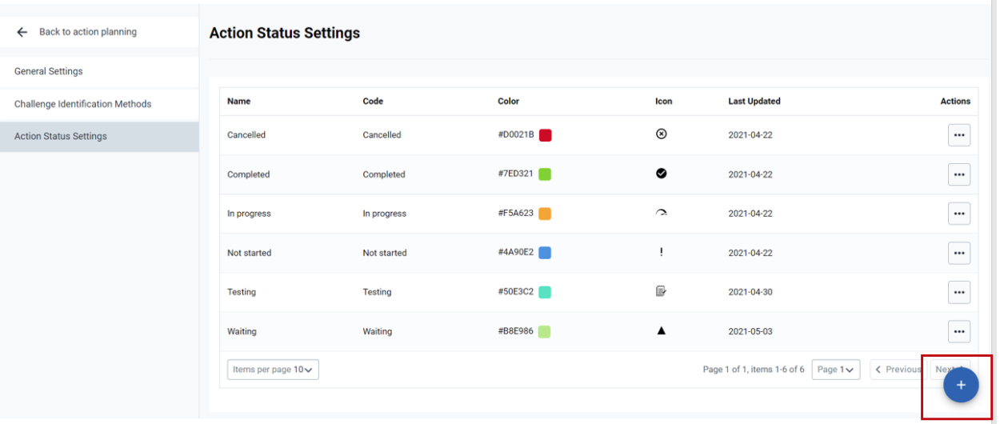

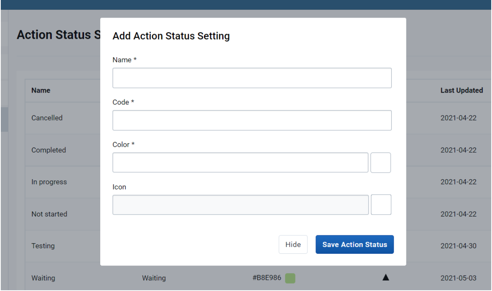

### 4.4.2 Managing action status option

On the list of registered action status option, administrators may click on actions option to be able to delete or edit details of the existing action status option.

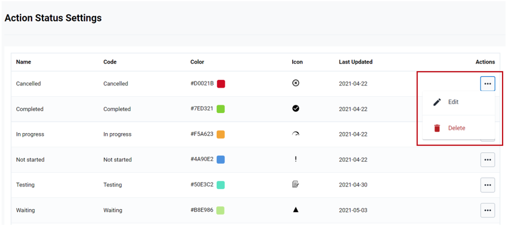

To edit details of existing action status option, user should click on Edit option and update the action status option details. Upon completion of updating the action status details, user should click on Save Action Status button to save changes.

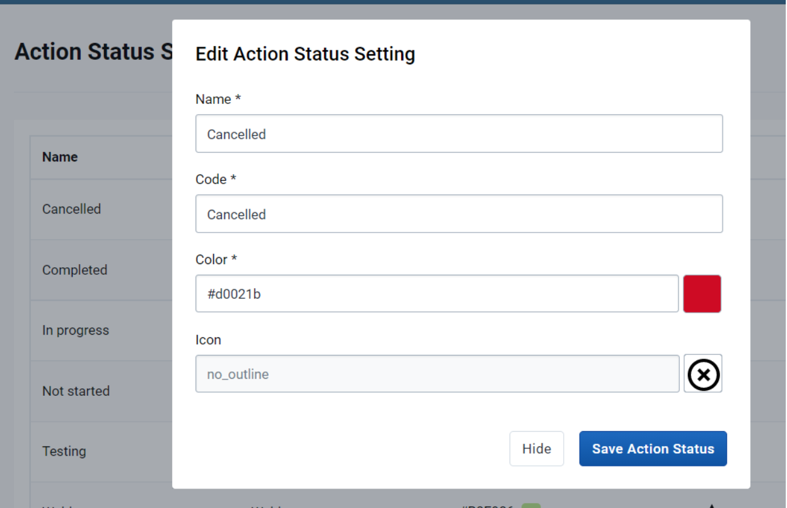

To delete the details of existing action status option, user should click non Delete option. To delete the method, user should click on Delete button on the deletion confirmation pop-up form.

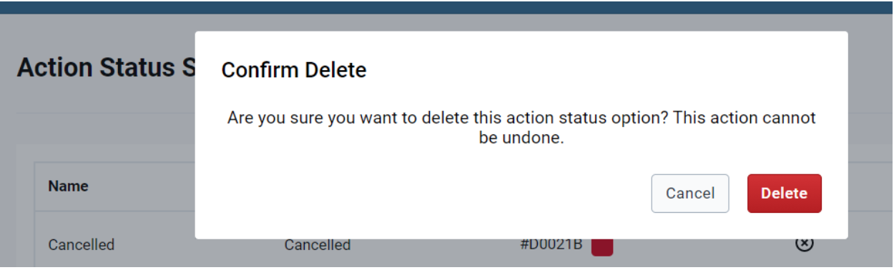

### 4.5 Re-accessing normal users’ module

To access the options for normal users, the administrator should click on the Back to action planning option.

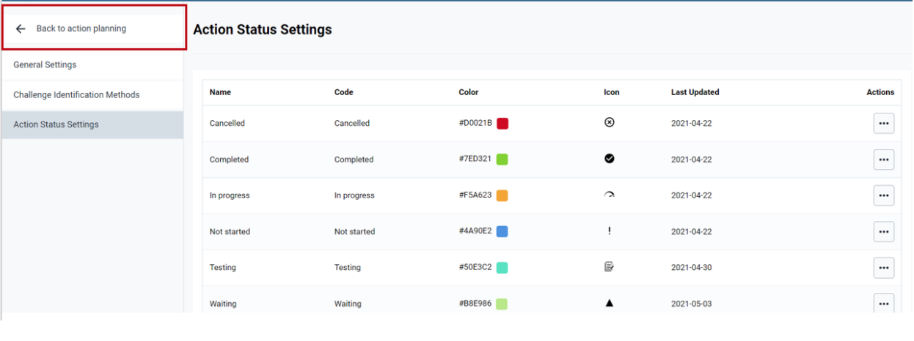