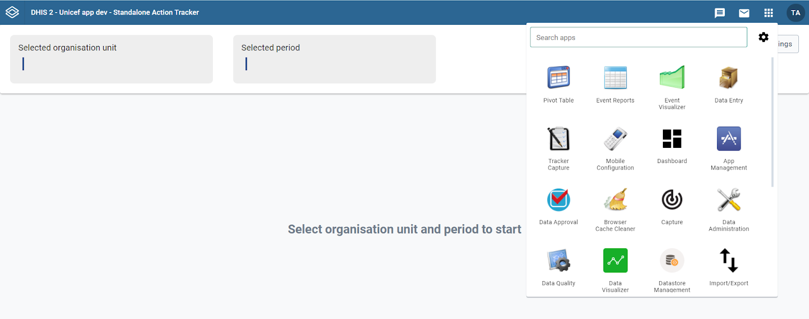
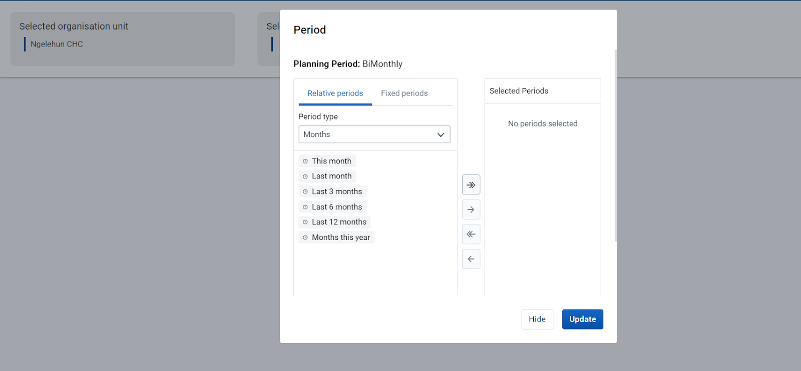

The Standalone Action Tracker Application is built on an architecture that eases user interactions by having a design concept that promotes the user to follow their intuition complemented with high performance that considers the lowest internet connection scenarios with descriptive notification messages if the user misses a step along the way.

# Standalone Action Tracker App Design Concepts

## Do more with fewer steps

Most of the operations in the application can be achieved in three steps or less. The Standalone Action Tracker App gives the user at any level with no information system administration privilege the ability to perform operations without a need to switch between modules or drop ongoing activities. Users can select locations (organization units) that are automatically linked with pre-defined planning cycle frequencies e.g., six-monthly, bi-monthly, etc. 

## Trust your intuition

The Standalone Action Tracker App has been built to make functionalities more accessible, more intuitive, and most importantly more capable. The App follows a minimalistic design that minimizes any chances of the user getting lost in the middle of performing their usual operations.

# Layout of the Standalone Action Tracker App

The Standalone Action Tracker App is flexible enough to adapt to any number of user journeys and planning cycles depending on project implementations. The layout has two main sections, The first section is for users who can do the configuration of the metadata to be used e.g., how action tracking status should be named (completed or ongoing or canceled, etc.,) and the second section is for users who use the app for documenting plans and tracking implementation status.

The user who manages the configuration section can manage what data to be collected during planning and tracking and define relevant planning and tracking cycles. The ability to link planning cycles with implementation levels makes it possible for users from the corresponding levels to link actions with their respective planning cycles. For example, if at council level planning is done every six months, then the Standalone Action Tracker app allows users to document plans and track them in six-month periods.

# Global DHIS2 Menu

When using the Standalone Action Tracker App the Global DHIS2 Menu is accessible on its usual position. The user can use the global menu to access other apps and to log out of the system. Most of the app notifications will pop up on the top position where the DHIS2 global menu exists.

{ .center width=80%}

# Organization Units and Period for Tracking

The option to select organization unit and planning period is found just under the DHIS2 global menu. Users can select organization units they want to view or document actions. Upon selection of the organization unit, users will be able to select the corresponding period that they want to manage actions and/or track them.

___Note___: Tracking periods are linked with predefined planning cycles for the corresponding organization unit level.

{ .center width=80%}

{ .center width=80%}
<em>___Note___:The Standalone Action Tracker app notifies about the allowable planning level.</em>

{ .center width=80%}

<em>___Note___:The Standalone Action Tracker app notifies about the allowable planning cycle for the selected organization unit level.</em>

# Installing the Standalone Action Tracker

The Standalone Action Tracker is publicly available as a DHIS2 custom application in the app hub [(https://apps.dhis2.org)](https://apps.dhis2.org). You must have admin access to be able to install the app.

To install the app in your DHIS2 instance click on the global DHIS2 menu and open the App Management app. On the app, on the left-hand menu, select App Hub. A list of available apps to download will appear. You can then search for the Standalone Action Tracker app, click on it, and on the app details page, click Install. You will get a notification if the app has been successfully installed. When you refresh the page and click on the global DHIS2 menu, the Standalone Action Tracker should be one of the listed apps.
