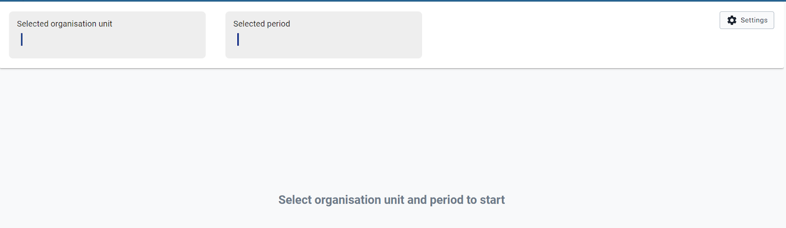
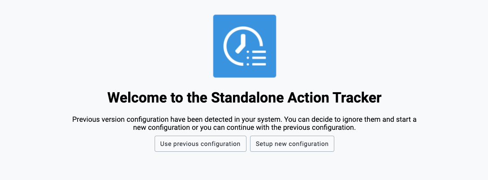

# Standalone Action Tracker App architecture

The Standalone Action Tracker Application is built on architecture that eases the user interactions by having a design concept that promotes the user to follow their intuition complemented with high performance that considers the lowest internet connection scenarios with descriptive notification messages if the user misses a step along the way.

## Standalone Action Tracker App Design concepts

### Do more with less steps

Most of the operations in the application can be achieved in three steps or less. The Standalone Action Tracker App gives a district user or any user at any level with no administrative privilege the ability to perform operations without a need to switch between modules or drop ongoing activities. Users can select locations (organization units) that are automatically linked with pre-defined planning cycle frequencies e.g., six-monthly, bi-monthly etc. 

### Trust your intuition

The Standalone Action Tracker App has been built from the ground app, to make functionalities more accessible, more intuitive, and most importantly more capable. The App follows a minimalistic design that minimizes any chances of the user getting lost in the middle of performing their usual operations.

## Layout of the Standalone Action Tracker App

The Standalone Action Tracker App is flexible to adapt to any number of user journeys and planning cycles depending on country’s implementations. The primary two users are the Administrator who can manage the metadata and planning cycles, the district users who documents actions and tracks their corresponding implementation. 

The administrator can manage indicators and define relevant planning cycles for each level. Ability to link planning cycles with implementation levels make it possible for users from the corresponding levels to link actions with their respective planning cycles. For example, if at council level planning is done every six months, then the Standalone Action Tracker app allows users to document plans and track them in six months periods.

Other bottleneck App users can be national, and regional/counties users who can only view analytical reports and view documented actions and their corresponding tracking information.

## Global DHIS2 Menu

When using the Standalone Action Tracker App the Global DHIS2 Menu is accessible on its usual position. The user can use the global menu to access other apps and to log out of the system. Most of the app notifications will pop on the top position where the DHIS2 global menu exists.

{width=80%}

## 2.4 Organization units and period for tracking

The option to select organization unit and planning period are found just under the DHIS2 global menu. Users can select organization units they want to view or document actions. Upon selection of the organization unit, users will be able to select the corresponding period that they want to manage actions and/or track them.

Note: Tracking periods are linked with predefined planning cycles for the corresponding organization unit level.

{width=80%}

{width=80%}

__Note__: 
* Standalone Action Tracker app notifies about the allowable planning level.

{width=80%}

__Note__: 
* Standalone Action Tracker app notifies about the allowable planning cycle for the selected organization unit level.

{width=80%}
