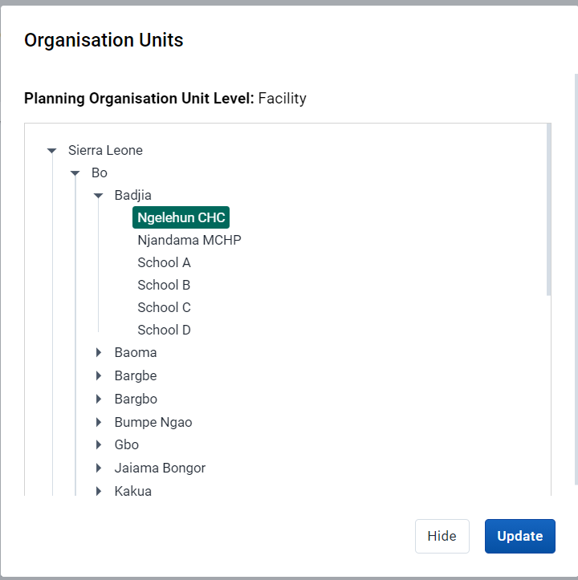
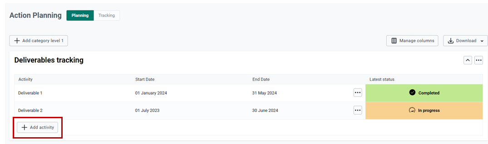
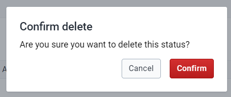
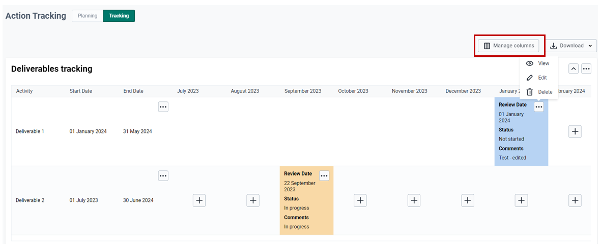

The Standalone Action Tracker App can be found in the Apps menu. if the application has not yet been installed in your DHIS2 instance or the installation has issues, refer to the installation instructions (Section 3.5) of this documentation for further guidance, or contact the DHIS2 administrator for your instance.

{ .center width=60%}

# Using Global Filters

## Organization units selection

The Standalone Action Tracker App allows the user to make organization unit selections based on implementation levels.

__Note__: The options for organization units’ selection will be limited based on the user's account. Standalone action tracker app inherits DHIS2’s configurations including the user’s predefined locations when his/her account was created.

{ .center width=60%}

{ .center width=60%}

__Note__: Selection of the organization units should be aligned with the allowable planning level

## Period selection

The Standalone Action Tracker App allows users to make period selections for fixed periods, relative periods and extended relative periods.

All period selection types begin with clicking the period button on the global filters menu. Then clicking on the period type select option button which lists all the period types.

__Note__: Users should only select a period as per allowable planning cycle for the selected organization unit level. For example, if planning is done annually, then users should select years. The Standalone Action Tracker app has included a reminder of allowable period selection

{ .center width=60%}

### Fixed period selections

To select fixed periods, start by selecting a period type from the period type list. You can then select periods from the list of available periods.

{ .center width=60%}

### Relative period selections

To select relative periods start by selecting a period type from the period type list. You can then select periods from the list of available periods.

{ .center width=60%}

# Action planning

The first part of using the standalone action tracker allows users to document actions related to plans that they have done or components they want to track progress and status for. Management of action planning can be done in multiple category option levels, allowing users to define multiple levels each with their own activities or issues to plan and later track status for.

## Managing category levels

Management of category levels allow users to define levels under which they may add activities to be tracked.

### Managing category level

{ .center width=80%}

{ .center width=60%}

{ .center width=80%}

{ .center width=60%}

{ .center width=50%}

{ .center width=60%}

## Managing category levels

### Managing activities

For each category level added, users may define multiple activities whose status will be tracked

{ .center width=80%}

{ .center width=60%}

__Note__: The fields appearing on figure x above are the ones added under the Action planning section in the configuration module (section 4.4)

{ .center width=80%}

{ .center width=60%}

{ .center width=60%}

{ .center width=50%}

## Managing columns and downloads

### Managing columns

Users can manage columns to be displayed by selecting which ones to be displayed and which ones should not.

{ .center width=80%}

{ .center width=60%}

### Downloading category data

Users can download planned and tracked actions in Excel, CSV, JSON, and PDF versions

{ .center width=80%}

{ .center width=80%}

# Actions Tracking

The actions tracking section allows users to manage tracking of status of actions defined for each planned activity. Tracking of action status is allowable in period as configured in configuration module (Action tracking period section). For each period, users will be able to add status update for each action defined

## Tracking action status

To Access action tracking panel, user should click on “Tracking” label

{ .center width=80%}

## Managing status

For each activity, user may update status for the given tracking period by clicking on

{ .center width=80%}

{ .center width=60%}

__Note__: Actions to be selected here are the ones configured in the Configuration module. Each user may define action status to meet their requirements

To view, edit or delete the tracking status, user can access the navigation options for the action and select appropriate action he/she wants to do

{ .center width=80%}

{ .center width=60%}

{ .center width=80%}

{ .center width=50%}

## Managing columns

User can manage which columns to be displayed in the action tracking panel by clicking on the "Manage Columns" option then selecting or deselecting columns to shown or not shown

{ .center width=80%}

{ .center width=50%}

## Downloading category data

User can download the action tracking data in different formats including Excel, CSV, JSON, and PDF.

{ .center width=80%}