The Standalone Action Tracker App includes a module for administrators to configure key metadata for the normal user. The administration configurable options include:-

1. __General settings__: management of planning period, tracking period, planning and tracking organization unit level, as well as sharing

2. __Categories settings__: management of categorization of the actions. This allows you  to configure which data to collect for each level of categorization 

3. __Action settings__: management of what data to collect when planning actions and  possible status options for actions and labels to be associated with activities tracking when the user tracks the status of the action. Users will be able to add all the key fields for tracking action e.g., activity or action name, activity or action description, start date, and end date.

# App Access and Authorization Configuration

Before any user can use the app, they must have proper access to the application and proper authorization to perform different tasks within the app. These configurations are controlled by the DHIS2 core system and can be configured in the Users app.

## Access to the application

To assign the app to a user role, select the ‘actiontracker standalone app’  under app authorities in the user role configuration. 

## In-app authorization

The Standalone Action Tracker comes with in-app authorities that must be configured for each user role with access to the app. The in-app user authorities are Configure, Planning, and Tracking.

__Configure__: This gives the user access to perform administrative tasks (Configuring of app metadata).

__Planning__: This allows the user to add, update, and delete planning data within the app.

__Tracking__: This allows the user to add, update, and delete tracking data within the app.  

To assign these authorizations to different users, select the relevant authority from the list of available system authorities in the user role configuration. The authorities are prefixed with the app name (for example, the configure authority will appear on the list as ‘Standalone Action Tracker - Configure’ ).

Note: User roles  with ‘ALL’ in the system authorities will be authorized for all in-app authorities.

# First Time Configuration

## Existing configuration for version 1.x.x

When you open the Standalone Action Tracker app for the first time it will check for existing configuration. If you had a previous version of the Standalone Action Tracker installed, a page that shows options to either continue with the old configuration or set up a new one will appear. 

If you have existing data or if you find the previous version of the Standalone Action Tracker worked well for you then choose ‘Use previous configuration’. This option will modify the existing metadata and migrate the existing data to the modified  configuration. This process may take a while if there is a lot of data.

If you do not have existing data or do not want to use the existing configuration choose ‘Setup new configuration’. This will take you to a setup of a new configuration.

{ .center width=80%}

## New configuration

If you are using the Standalone Action Tracker app for the first time, you will be directed to the welcome page. The welcome page. The welcome page will give 3 data model options on how you can use the Standalone Action Tracker to track actions. The options differ in the levels of categorization of your actions.

__Basic activity tracking__: This provides a data model to categorize actions into one level only.

__Secondary activity tracking__: This provides a data model to categorize actions into 2 levels.

__Tertiary activity tracking__: This provides a data model to categorize actions into 3 levels. 

The selection of a data model depends on how your planning data is structured. For most implementations, basic and secondary should suffice. In more complex structures (a good example is BNA’s root cause entry data model) you can use the tertiary model. 

The 'BNA linked action tracking' is disabled as it is currently not supported but will be supported in later versions. 

{ .center width=80%}

After selecting the suitable data model, you have to provide a name and code for the selected configuration. The name should describe the data or intervention you will be tracking. The code should be less than 10 characters and should be descriptive of the data or intervention being tracked. 

Clicking on save will set up the configuration and navigate to more administration configuration.

# Accessing Administration Module

To access the Standalone Action Tracker administration module, click on the Configure button.

__Note__: Only users whose accounts have administrative privileges can access the configuration module

{ .center width=80%}

# Managing General Settings

The general settings allow users to manage the following three options:

1. __Organizations units__: Configuration of the organization units for which planning and action planning and tracking can be done. Organization units configuration allows the selection of specific organizations as well as preferred levels or groups amongst the organization units. Configuration of organizational units also allows users to decide if planning should be limited to selected organization units but also defining the default organization units. The default organization unit is what the app will pre-select as the organization unit when it first opens.

2. __Planning and tracking period__: This allows the user to define the planning and tracking frequencies. Tracking frequency can only be a subset or the same as the planning frequency. For example, if planning frequency is Monthly then tracking frequency cannot be Yearly but rather monthly, weekly or daily. Users are also able to define the default period. The default period is what the app will pre-select as the period when it first opens.

3. __Access and Sharing__: This allows the configuration of who has access to the specific configuration. Access can be granted to a specific user, a user role, or a user group. 

4. __Configuration deletion__: This allows the deletion of the configuration as well as all associated metadata. 

{ .center width=80%}

{ .center width=60%}

{ .center width=60%}

{ .center width=60%}

{ .center width=60%}

# Managing Categories Configuration

The categories configuration allows users to configure "Categories" under which different actions for activities can be tracked. An example of "Category” could be a project "Workstream" or "Deliverable" under which there are several activities to be tracked. The number of categories to configure will depend on the selected data model (See section 4.2.2 New configuration). The basic activity category will have 1 category, the secondary will have 2 categories, and the tertiary will have 3 categories. These categories will be nested (for example, category 2 will be a child of category 1). The activities will be associated with the last level of the categories. For each configuration of the "Category" the user can define the category name. The name will be used to associate all data created for this category. For example, when adding data to a category named Area, the button will say "Add area". 

The user can also configure what data can be collected for the category. They can define data fields to collect different data types. Currently, the app supports text, number, long text, and date data types. The fields can also be from already existing metadata within DHIS2.

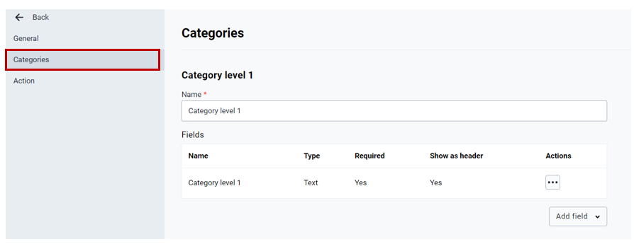{ .center width=80%}

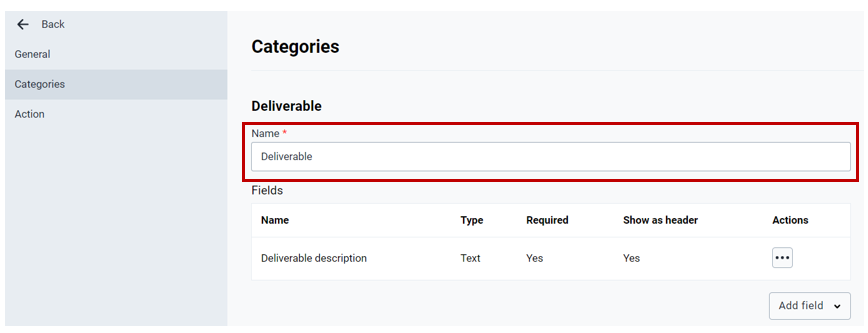{ .center width=80%}

To add a new field for the category, click on the “Add field” button. 

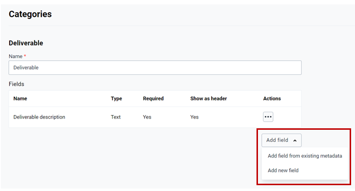{ .center width=60%}

__Note__: User can add a new field by copying metadata from the existing field (click on Add field from existing metadata) or defining fields (click on Add new field).

__Note__: When you select existing metadata, the app will modify its configuration to match other Standalone Action Tracker metadata and may affect other implementations that use the metadata. It is not recommended to select this option for metadata that is shared across different implementations.

Adding a new field allows the user to define:

1. ***Display name***: the name of the field to be tracked for the action e.g., Deliverable inception date
2. ***Short name***: short name (variable name) of the field to be created e.g., Start Date
3. ***Type***: definition of nature of data expected to be collected for the given field. User may select and categorize the field as Text, Long Text, Number, Integer, or Date
4. ***Mandatory check***: user may define if the field added should be mandatory or optional. To make the field mandatory user should select the checkbox labeled “Field should be mandatory”
5. ***Header display/Column display***: the user may define if the field to be added should be displayed as a header for the first category or as a column for the rest of the categories. 

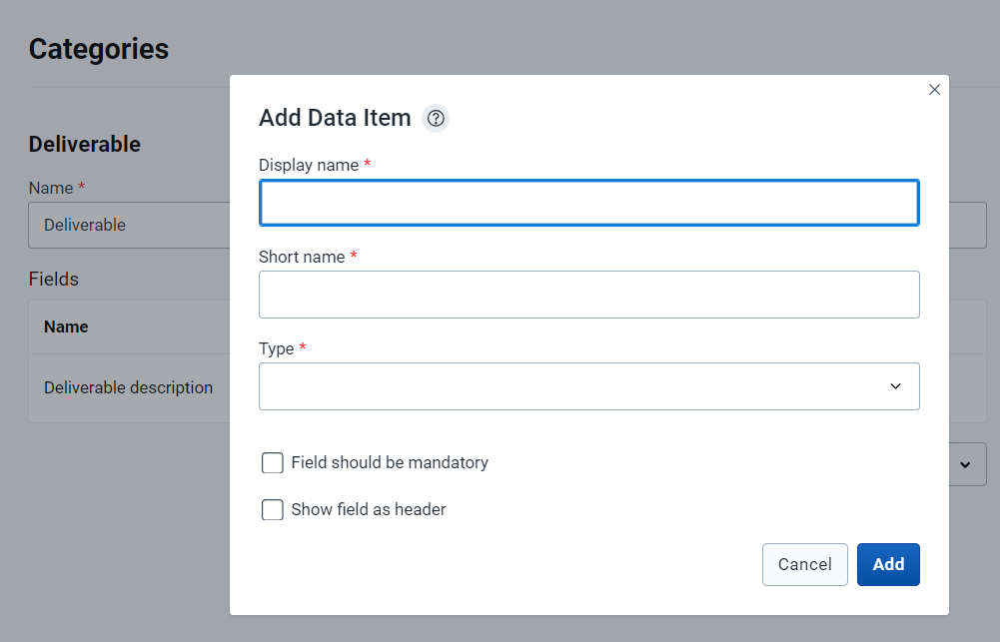{ .center width=60%}

When defining a new field, the user may also add option sets  (predefined field options). For example, if a user is adding a field to track if the deliverable is already assigned to a focal person or not, then an Option field for responses Yes/No may be added.

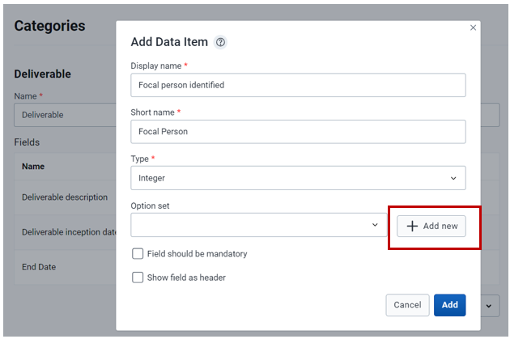{ .center width=60%}

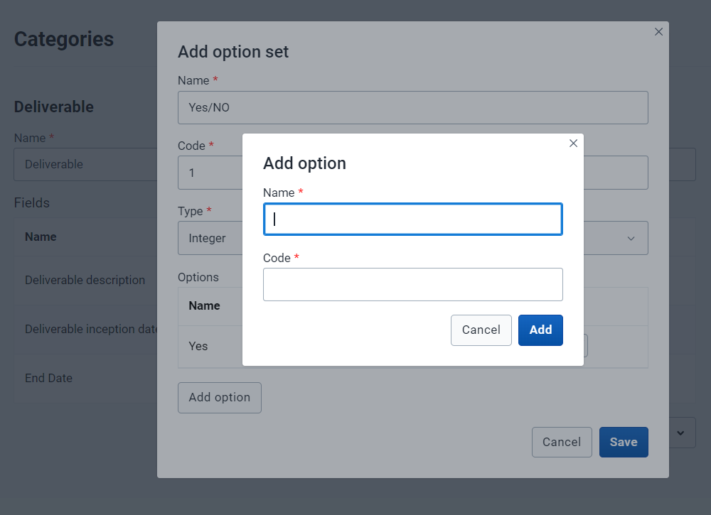{ .center width=60%}

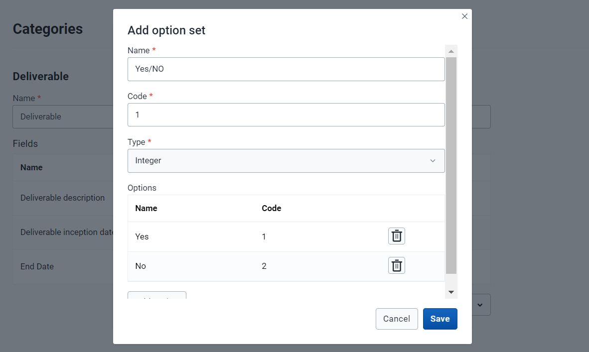{ .center width=60%}

Adding a new field from existing metadata, the user will have to select the field from the list of existing fields that already exists.

{ .center width=60%}

To edit or delete a field, the user should click on options under the actions column

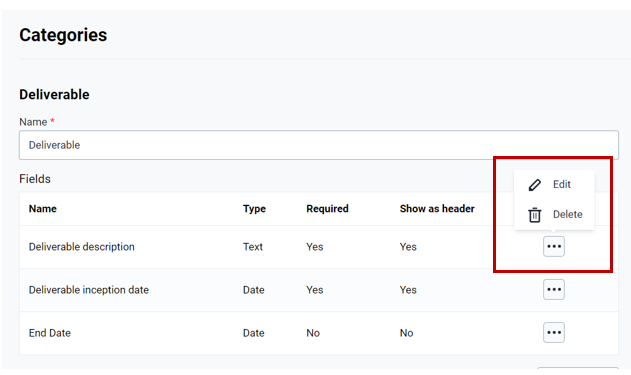{ .center width=60%}

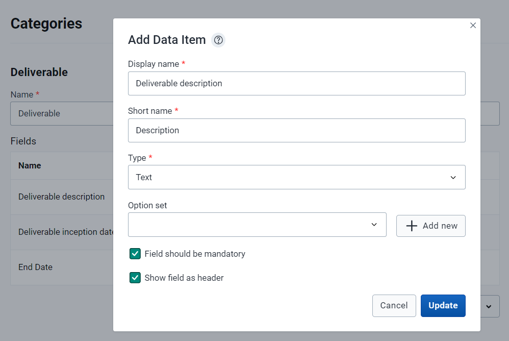{ .center width=60%}

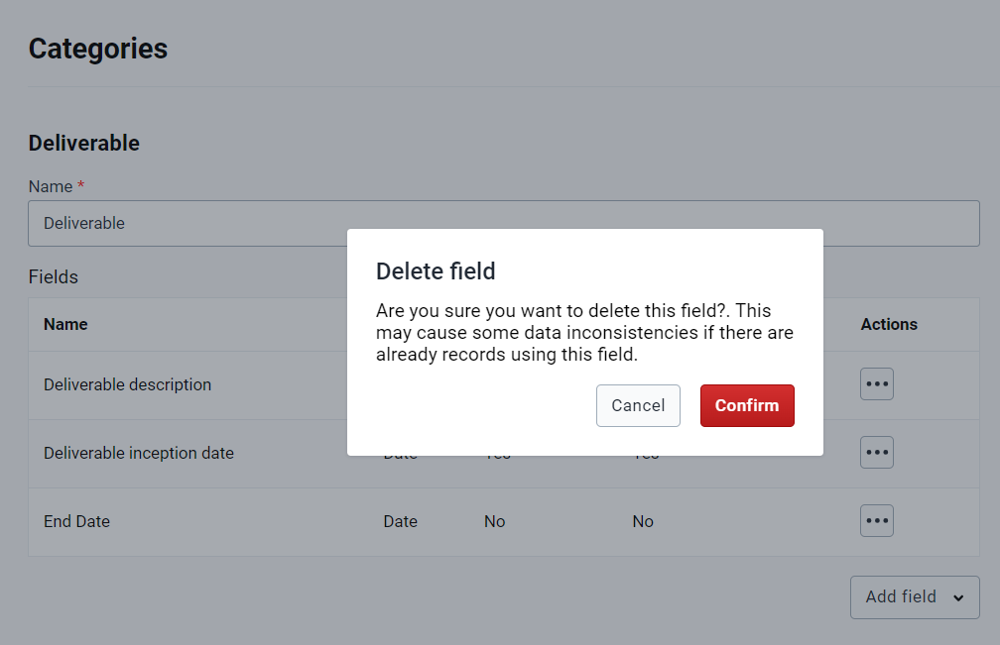{ .center width=60%}

# Managing Action Configuration

Action configuration allow users to manage:

1. ***Action planning***: this section allows users to manage relevant fields that need to be documented when planning an action. Examples of such fields include Activity name, Description, Start Date, and End date. The fields managed under the action planning section will be completed at the stage when the user is defining (planning) the action or activity to be tracked.
2. ***Action tracking***: this section allows users to manage relevant fields for managing the tracking of actions. Examples of such fields include status and comments. The fields managed under the action tracking section will be completed during the period of reviewing the action.
3. ***Action status options***: this allows the user to configure custom options. Configuration of status options allows the user to define the status name, code, color, and icon.

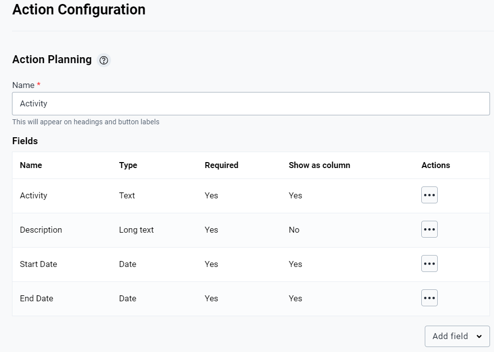{ .center width=60%}

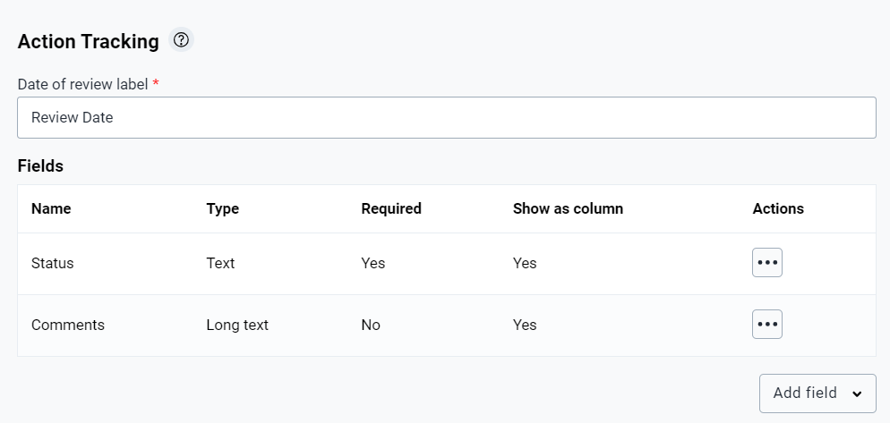{ .center width=60%}

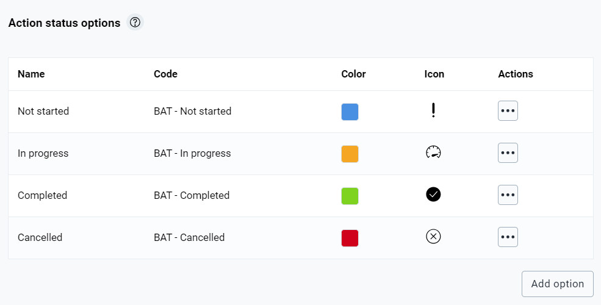{ .center width=60%}

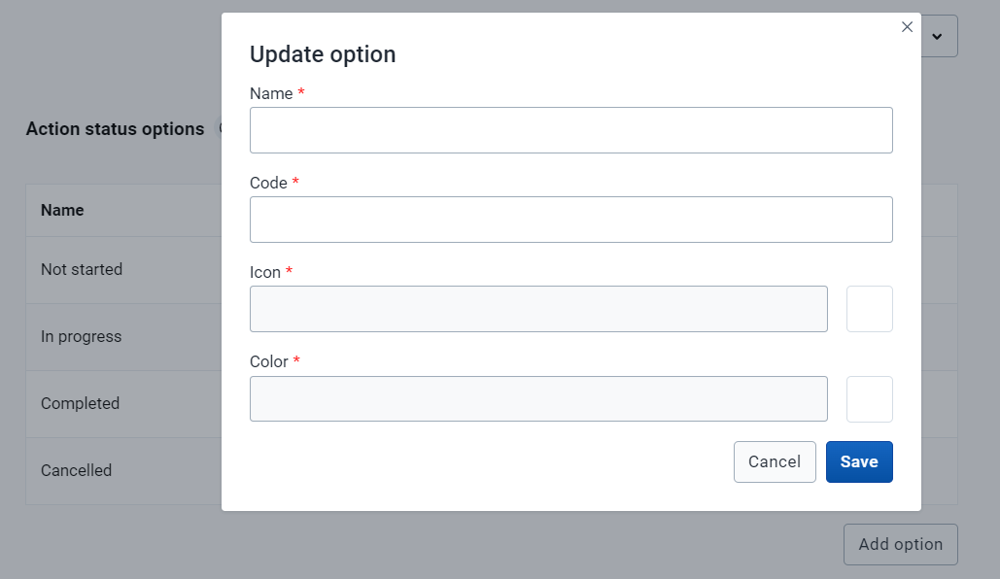{ .center width=60%}

Adding new option form for action status allows users to define:

1. ***Name***: what the status should be called e.g., postponed, canceled, completed, etc.
2. ***Code***: code for the status action
3. ***Icon***: A symbol to be used to indicate the status during tracking
4. ***Color***: Colour code to be used when displaying status

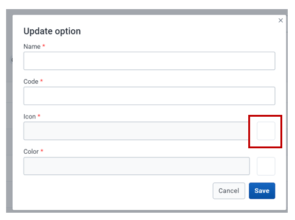{ .center width=50%}

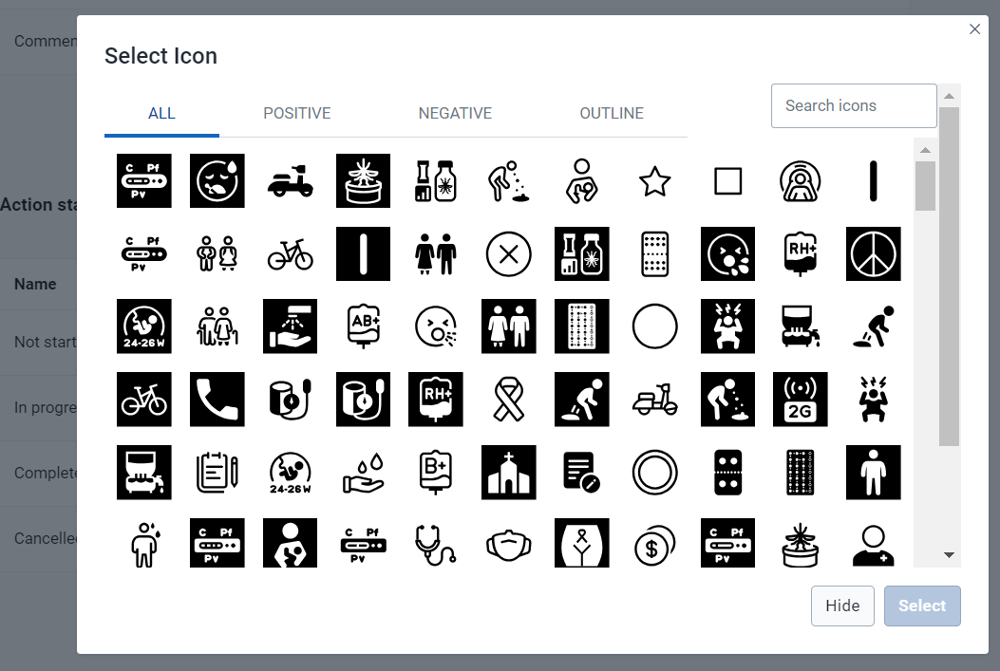{ .center width=60%}

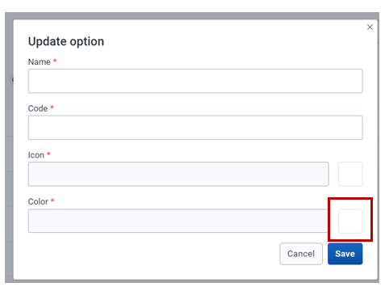{ .center width=50%}

{ .center width=60%}