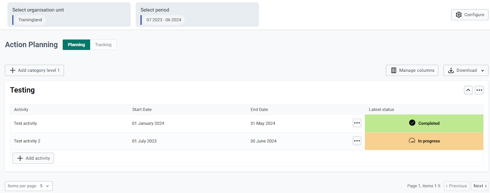

# Standalone Action Tracker App Demo server

## Introduction to the Standalone Action Tracker App

Action tracking is a key concept to support follow-ups on planning done by implementers at different levels in the health system. The standalone alone action tracker app is built on the work done on the linked action tracker app which supported and was linked with the Bottleneck Analysis (BNA) App.

The Standalone Action Tracker App is developed and maintained by the HISP Community (UiO, HISP-Tanzania and HISP Uganda) in collaboration with UNICEF. The standalone action tracker app is available here for download.  It is currently compatible with DHIS2 2.28 and above.  

{width=80%}

## Advantages of the Standalone Action Tracker App

The Standalone Action Tracker App builds on the work done on the linked Action Tracker App that was linked with the Bottleneck Analysis App. The bottleneck analysis and planning approach contribute to existing national and sub-national planning and monitoring cycles by offering a strategic, rapid and systematic approach to analyzing key health systems barriers to reaching intervention coverage targets. The Standalone Action Tracker app allows planners to document actions based on bottlenecks found using bottleneck analysis and other methodologies.

## Rationale for the standalone action tracker App

The initial Linked Action Tracker tracker was directly associated with the Bottleneck Analysis app to allow issues identified through the BNA app to have corresponding action documented and tracked. The reality on the ground is not all health systems planners use the BNA approach to identify issues. Regardless of the methodology used to find bottlenecks during planning, it is crucial for planners to have a tool to allow them to document and track actions. This necessitated the need to have a standalone action tracker that allows actions documentation and tracking regardless of the method used to identify bottlenecks.

Health managers have competing demands resulting in limited time, resources and training to conduct data analysis. Collecting data from multiple sources and preparing it for analysis themselves can be a barrier to effectively using data for planning.  While the growing trend of building dashboards into DHIS2 is encouraging, too often the information displayed in dashboards is a collection of related (or sometimes unrelated) indicators rather than a well thought out process (or framework) of how a workflow or intervention works.  The standalone action tracker app helps address these issues by automating data gathering and presentation within DHIS2 and displaying it in a manner that facilitates systematic analysis for programming and action tracking. 

Effective and timely use of data by stakeholders at all levels of the health system is critical for health service delivery. DHIS2 dashboards have the potential to enhance the use of data for decision making and planning by displaying information for managers in an accessible and actionable manner. This visualization is made possible by using the bottleneck analysis model integrated with the causality and tracking actions/solutions to effect interventions.

## About demo server and the Standalone Action Tracker App meta-data

The Standalone Action tracker app demo server is set up to support both development, testing, training and ensuring quality of features and functions of the demo server. Additionally, the demo server is also set up to host both demo data and metadata across various interventions to give chances to users of the system to explore and learn system features and functions. The current demo server can be accessed on: [DHIS2 demo server](https://hisp.apps.dhis2.org/training/)  

The server is hosted in the cloud and can be accessed on the internet via a browser from anywhere as long as there is availability of internet. 

### Using DHIS2 demo server	 	 	 		

To use the Standalone app demo server you will have to login into the server, you can use the login credentials that are displayed on the login page to login and explore the features of the Standalone Action Tracker app.

{width=80%}

         
### 1.6 Standalone Action Tracker App meta-data

The Standalone Action Tracker app borrows its meta-data from the general DHIS2 data source and uses this to create a data store for ease of tracking and analysis. Standalone Action Tracker App metadata such as indicators and indicator groups are managed using the DHIS2 Indicator maintenance App. 

{width=80%}

Complex indicators that require additional calculations are maintained using the function maintenance app. These include but are not limited to indicators on stock data, Human resources.

### 1.6.1 Functional Maintenance App

The Standalone Action Tracker App is also integrated with the function maintenance App, used to create custom indicators. Custom Indicators are indicators whose definition and calculation cannot easily be created using the Indicator maintenance app in the DHIS2. The app can be easily used by developers to create custom codes to retrieve and  use indicators with complex calculations. To use the app, find it [Here](https://play.dhis2.org/appstore/) 

{width=80%}				